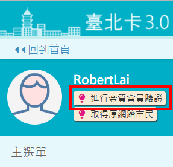
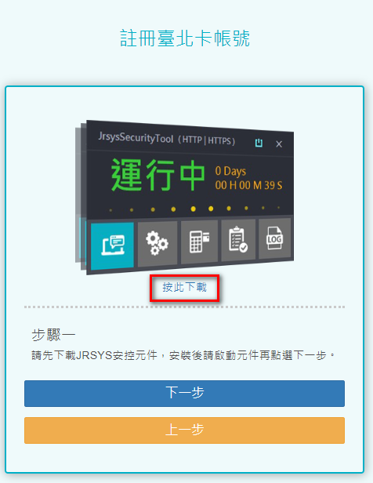
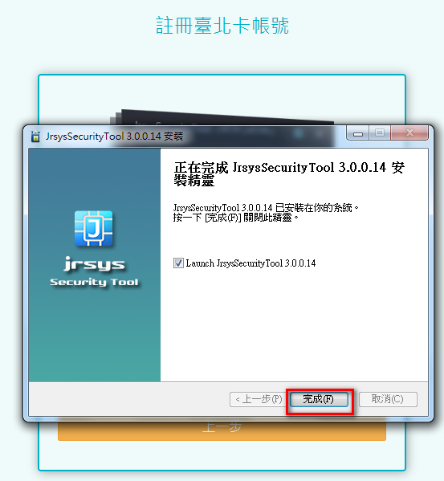

# 臺北卡快速操作集

##  1.線上作業 :一般會員升級為金質會員

###  step1 使用者透過線上認證\(手機認證、電子郵件認證\)或經由手機安裝\[行動臺北卡\]應用程式註冊成為一般會員。

###  step2 使用者以一般會員身分登入系統，在個人資料維護功能裡，點擊 \[金質會員認證\] ，透過 自然人憑證認證成功來升級成金質會員。

####  1.進行金質會員認證

####  2.下載安控元件

**※目前只限使用Windows7以上版本 IE或Chrome瀏覽器進行安控元件下載和使用。**

####  3.安裝安控元件

####  4.執行安控元件

####  5.輸入身分證字號 

####  6.輸入自然人憑證密碼\(6到8碼\)

####  7.成功升級為金質會員

##  2.臨櫃作業: 透過臨櫃服務人員協助，註冊成為金質會員

###  使用者到區公所及臺北卡整合之各項服務申辦窗辦理，提供相關文件證明，透過臨櫃服務人員協助升級為金質會員。

