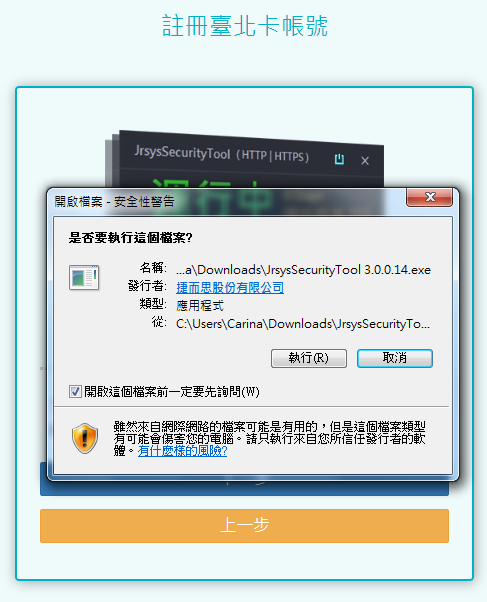

# 臺北卡3.0金質會員申請步驟

## 臺北卡3.0一般會員申請步驟 

### 1. 在電腦上打開瀏覽器，連上臺北卡網站\[https://id.taipei/tpcd\]，滑鼠點擊桃紅色按鈕\[申請臺北卡\] 

​

### 2. 點擊\[金質會員註冊\]選擇成為金質會員 

### 3.會員註冊頁面，請在此詳閱個資使用相關內容，打勾後按\[下一步\] 

​

### 4.在這裡可以選擇用手機號碼或電子郵件註冊，以電子郵件為例，輸入電子郵件後，按下藍色\[寄送驗證碼簡訊\] 

### 5.檢查您的手機是否收到簡訊，或是您選擇電子郵件認證的話，請登入您的電子郵件信箱檢查是否有新的電子郵件。 

### 6.在臺北卡網站上，輸入手機簡訊裡的驗證碼後，請勾選\[我不是機器人\]，再按灰色鍵下一步。 

### ​7.請填寫您的基本資料，如果您曾為網路市民會員，請在此按\[取回網路市民資料\] 。以下的案例不從網路市民帶入資料。 

### 8.依據提示的規則設定密碼後按註冊。 

### 9.註冊完成後您可以按\[是\]在此繼續進行金質會員認證，或\[否\]直接進入到臺北卡網站。在此請選擇\[是\]以繼續進行金質會員認證。 

### 10.請依照說明下載安控元件。

※目前只限使用Windows7以上版本 IE或Chrome瀏覽器進行安控元件下載和使用。

### 11.點擊已下載的安控元件安裝執行檔。

### 12.執行檔安裝時，會跳出數個警告訊息，請按\[執行\] 、\[確認\]或\[是\]以繼續下一步。

### 13.請按下一步以繼續。

### 14.若您接受授權協議便請按\[下一步\]以繼續安裝。

### 15.選擇安裝目標資料夾，若無特殊要求，這邊不需要修改資料夾，直接按\[安裝\]即可。

### 16.安裝完畢，請按\[完成\]以關閉安裝精靈。

### 17.關閉安裝精靈後，安控元件會自行啟動於右下角，一開始啟動時為\[Loading\]的狀態。

### 18.右下角的安控元件從\[Loading\]轉成\[Ready\]，此時請按鍵盤上\[F5\]鍵以刷新網頁。

### 19.右下角安控元件的狀態接下來轉為\[Going\]，表示其在運行中。

### 20.安控元件安裝並啟動成功後，可按下一步至步驟二，使用讀卡機插上自然人憑證且USB插在電腦上\(請確認讀卡機運作正常\)，輸入正確的身份證字號後按橘色鍵\[送出\]。

### 21.若讀卡機以及自然人憑證運作正常，網站上會跳出PINCODE 輸入框，請輸入自然人憑證PINCODE。

### 22.輸入自然人憑證PINCODE後，按\[OK\]即開始實名驗證。

### 23.實名認證成功後，您會得到一組帳號，密碼仍是您原來設的密碼。請牢記您的帳號。您可以在此用手機拍QR Code以下載行動臺北卡APP，或按橘色鍵\[登入臺北卡3.0網站\]。

### 24.登入臺北卡後，左上角的狀態會改成\[已實名\]，曾經在台北市各局處申請過的實名卡證服務則會列在右邊頁面。

