# 臺北卡3.0會員修改個人資料

## 請連結到臺北卡3.0網站 [https://id.taipei/tpcd/](https://id.taipei/tpcd/)

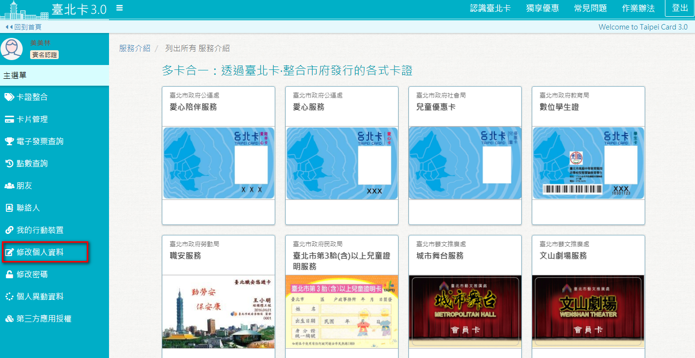

### 上傳/修改大頭照

#### 點擊紅框區域以上傳大頭照。

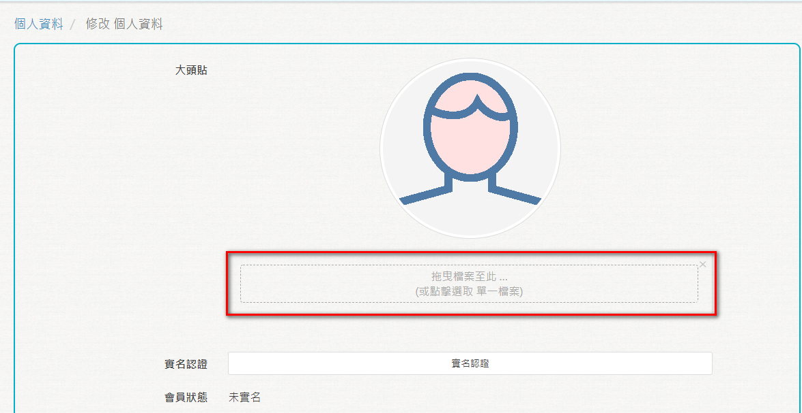

#### 系統會檢查上傳的照片格式，上傳成功後，即可在會員中心上看到大頭貼。若需要換大頭貼，一樣點擊下方紅色框的部份即可。

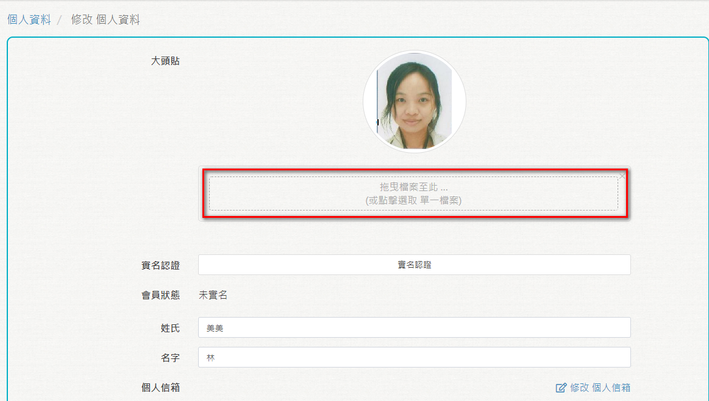

### 實名認證

#### 若一般會員還未成為金質會員，也可以在這裡進行實名認證。

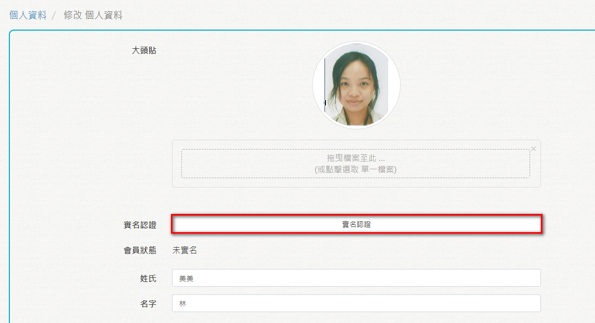

### 修改顯示名稱

#### 您可以在此修改顯示的名稱。

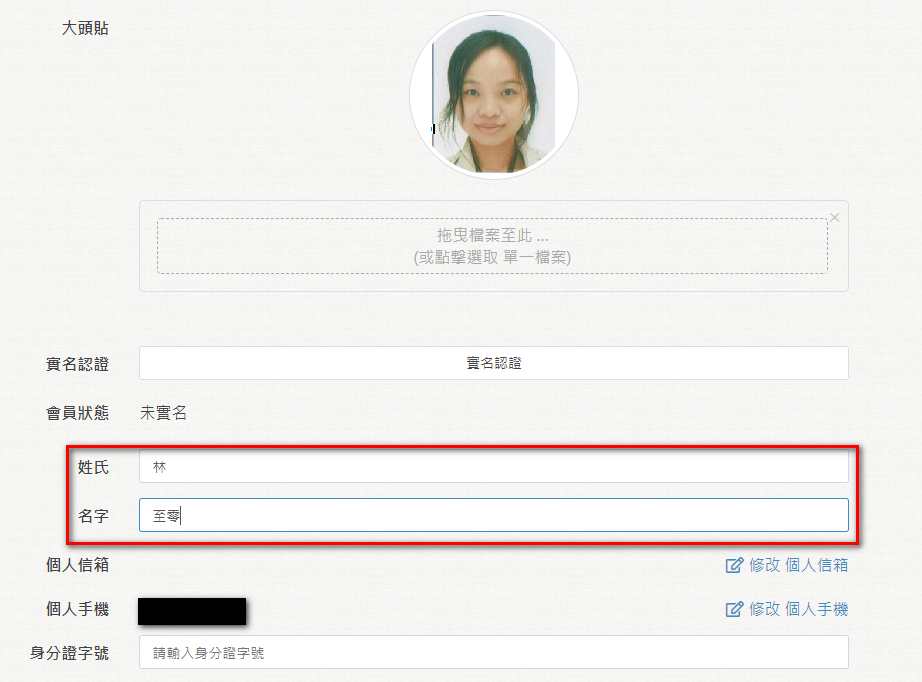

###  修改電子郵件

#### 您可以在此修改個人信箱，修改個人信箱或手機都必須再驗證一次。

#### 輸入新的E-mail，按下\[寄送驗證碼電子郵件\]，系統會寄一組6位數驗證碼到新的電子郵件。

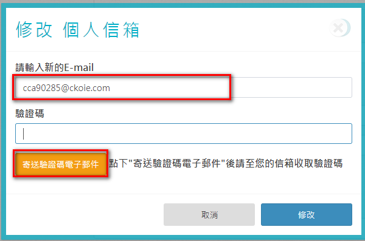

#### 請填入驗證碼後按\[修改\]

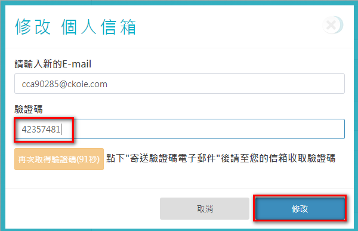

#### 個人信箱修改成功

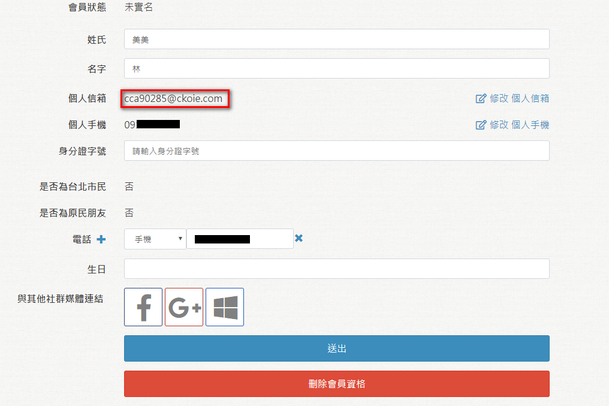

### 修改個人手機

#### 您可以在此修改個人手機，修改手機號碼會需要驗證。

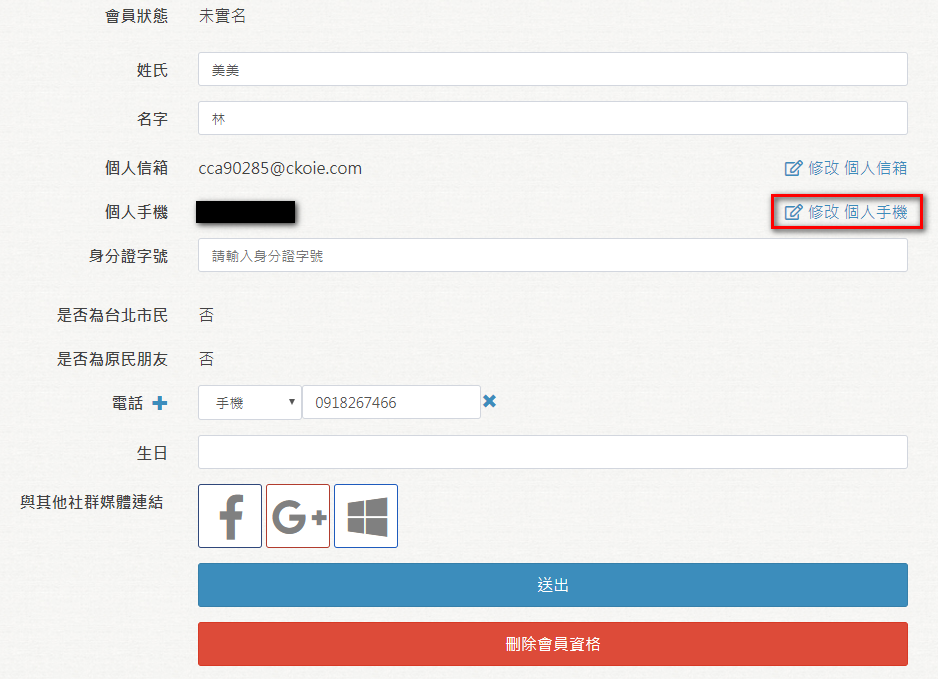

#### 輸入新的電話號碼後，點擊\[寄送驗證碼簡訊\]，系統會送一組6位數的驗證碼到此手機號碼。

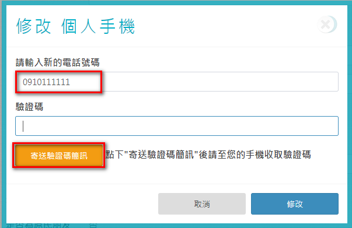

#### 在此輸入驗證碼後按\[修改\]

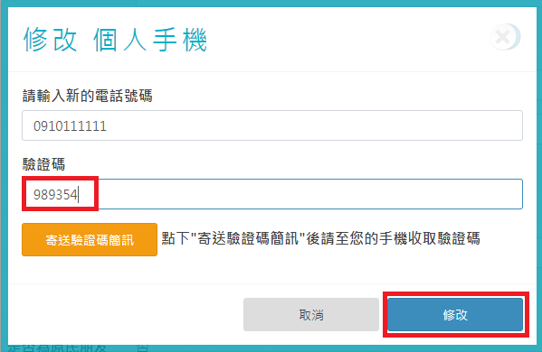

#### 個人手機修改成功

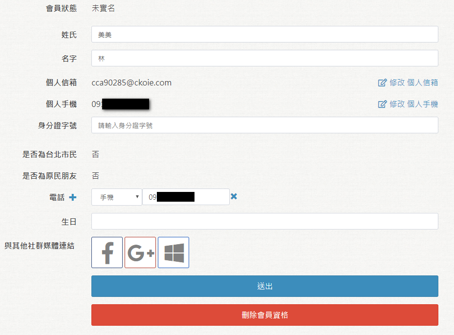

### 修改身份證字號

一般會員可修改身份證字號，已完成實名驗證\(金質會員\)後的身分證字號不得修改。

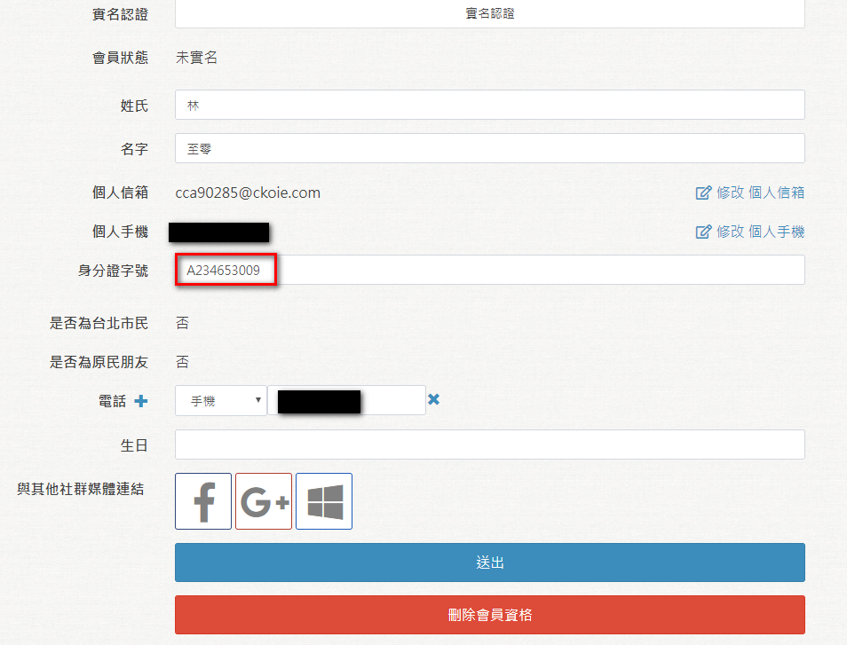

### 台北市民與原民註記

金質會員且經過戶役政系統查詢後，會在此欄位加註是否為台北市民或原民身份。台北市民或原民身份享有其特定的服務。這個欄位不開放使用者自行修改。

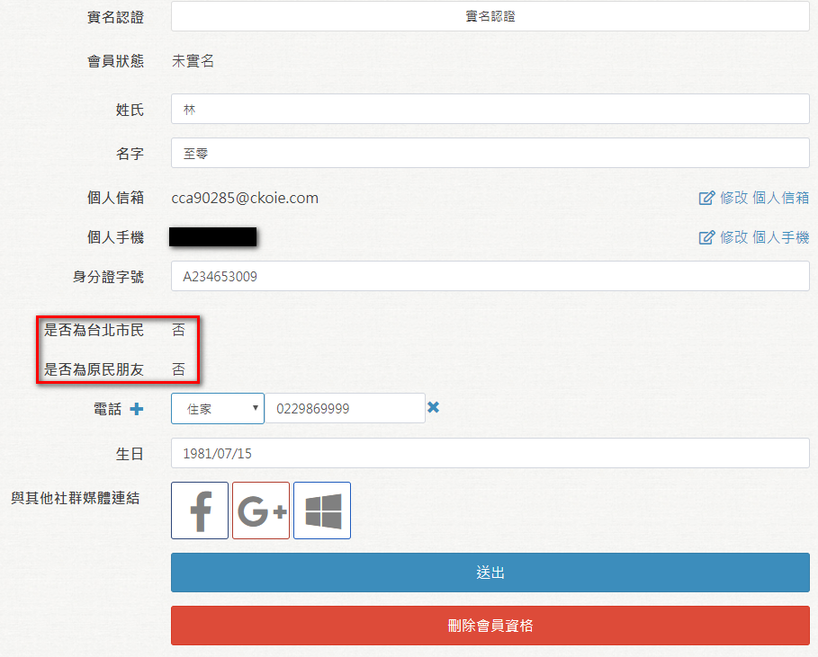

### 新增/修改電話

您可以在此新增/修改連絡電話，某些卡證服務可能需要您的電話號碼。

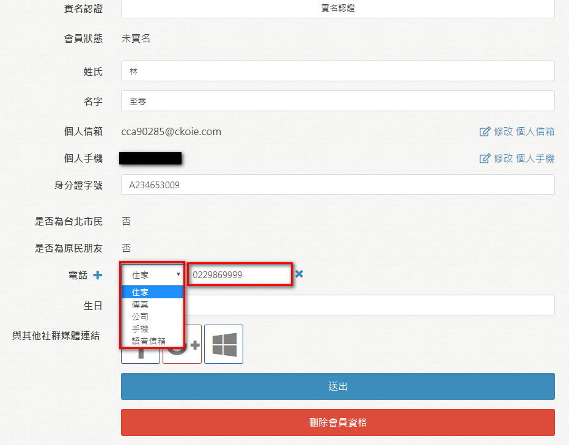

### 新增 /修改生日

您可以在此新增/修改您的生日，某些卡證服務可能需要這個資訊。

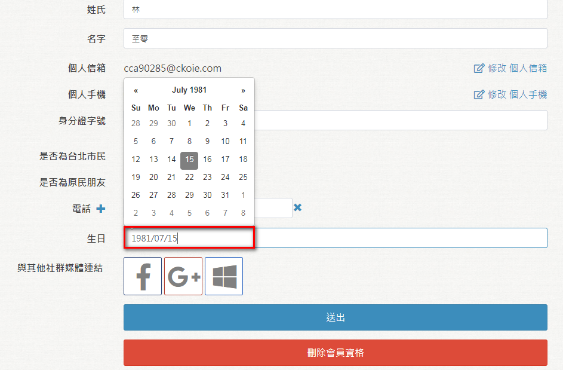

### 與社群網做連結

您可以將您的臺北卡帳號與FaceBook，Google 或MSN帳號做連結。

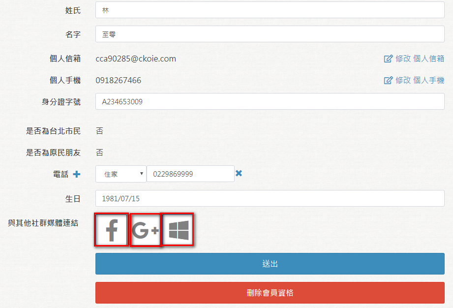

連結完成後，該社群網站的圖案會變色。以Google 為例:

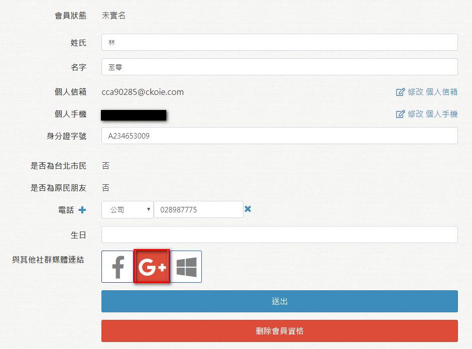

