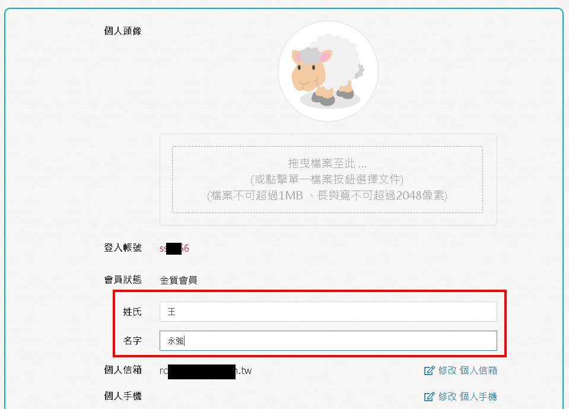

# 台北卡3.0會員修改個人資料

## 請連結到台北卡3.0網站 [https://id.taipei/tpcd/](https://id.taipei/tpcd/)

### 上傳/修改大頭照

#### 點擊紅框區域以上傳大頭照。

#### 系統會檢查上傳的照片格式，上傳成功後，即可在會員中心上看到大頭貼。若需要換大頭貼，一樣點擊下方紅色框的部份即可。

### 實名認證

#### 若一般會員還未成為金質會員，也可以在這裡進行實名認證。

### 修改顯示名稱

#### 您可以在此修改顯示的名稱。

###  修改或增加電子郵件

#### 您可在此修改個人信箱，修改個人信箱會需要驗證。

#### 輸入新的E-mail，按下\[寄送驗證碼電子郵件\]，系統會寄一組6位數驗證碼到新的電子郵件。

#### 請填入驗證碼後按\[修改\]

#### 個人信箱修改成功

### 修改或增加個人手機

#### 您可以在此修改個人手機，修改手機號碼會需要驗證。

#### 輸入新的電話號碼後，點擊\[寄送驗證碼簡訊\]，系統會送一組6位數的驗證碼到此手機號碼。

#### 在此輸入驗證碼後按\[修改\]

#### 個人手機修改成功

### 新增/修改電話

您可以在此新增/修改連絡電話或手機號碼，某些卡證服務可能需要您的電話號碼或手機號碼。

點擊加+號，可增加輸入的筆數，可下拉選擇要加入的類別，例如：住家電話、公司電話或傳真，右邊框框可輸入電話號碼或是手機號碼。

### 新增 /修改生日

一般會員可以在此新增/修改您的生日，金質會員時就不可以新增/修改生日，某些卡證服務可能需要這個資訊。

選擇生日欄位，最先出現的日期選擇，最右邊的圖，若有需要更換月份和年份，可以點選上面月份和年份紅色框框示意部分，就可以選擇目標日期。

### 送出變更

上述資料變更完成後，需要點選送出按鈕，資料才會更新。

帳號仍保留

### 退出台北卡會員

若暫時不需要此會員資料，可點選退出台北卡會員按鈕，就會將此帳號暫時關閉，並且登出系統

帳號仍保留，若有需要重新啟動，請聯絡台北卡客服，協助開啟帳號。

因帳號保留，因此若要將此手機或郵件合併到其他帳號，就會無法完成，請聯絡客服將此帳號刪除\(無法復原\)。 ​

