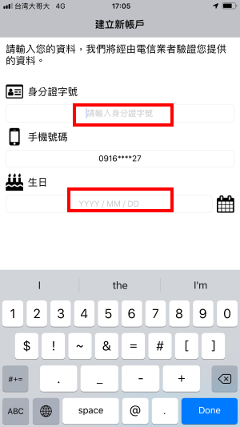

# 台北卡3.0電信實名驗證

### 台北卡電信驗證有下列限制，請特別注意，若不符合，建議採用自然人憑證或臨櫃方式進行金質會員升級作業。

1. 門號需為會員本人\(否則再執行業務上會有問題\)
2. 不能是公司或機關門號
3. 不能是易付卡門號
4. 組織會員不能使用電信驗證
5. 二類電信不適用，例如: 統一超商電信

### IOS請更新至版本1.0.22以上，ANDROID請更新至版本1.0.29以上。

## 操作步驟如下：

### 1.於行動台北卡APP登入一般會員\(※無台北卡會員的使用者可先註冊\)

### 2.一般會員升級金質會員提示，可使用電信驗證方式升級為金質會員

### 3.顯示注意事項，點擊【開始驗證】按鈕

### 4.顯示行動身分識別使用者同意書，請按下【我同意】按鈕。

### 5.電信驗證需要使用4G網路進行驗證 若使用的網路為WIFI會彈出下列訊息 

#### ※若手機使用雙卡機，驗證時需要選擇對應的網路， 例如： 

#### 1. 要驗證中華電信的門號就要選擇中華電信的4G網路

####  2. 要驗證台灣大哥大的門號就要選擇台灣大哥大的4G網路

####  3. 要驗證遠傳電信的門號就要選擇遠傳電信的4G網路

### 6.輸入認證帳戶的身分證字號/上網使用的門號/生日，按下【送出】按鈕

### 7.手機登入驗證：例如：圖形驗證、數字驗證、指紋辨識、臉部辨識，確認裝置為本人所有。

### 8.驗證成功，成為金質會員，會顯示實名帳號 

### ※仍可使用一般會員申請時的帳號登入\(手機號碼或電子郵件\)

### 9.升級為金質會員後請登出行動台北卡後重新登入

### 10.申請行動台北卡\(虛擬台北卡\)，點選”+”符號按鈕

### 11.金質會員申請好行動台北卡\(虛擬台北卡\)後，顯示行動台北卡和擁有的卡證服務

