# 臺北卡3.0群信驗證

## 操作步驟如下：

### 1.於行動台北卡APP登入一般會員\(※無臺北會員的使用者可先註冊\)

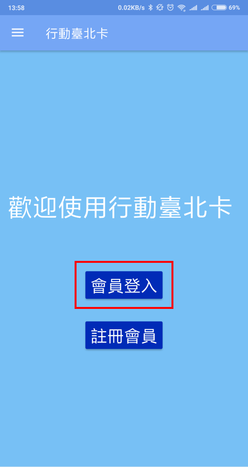

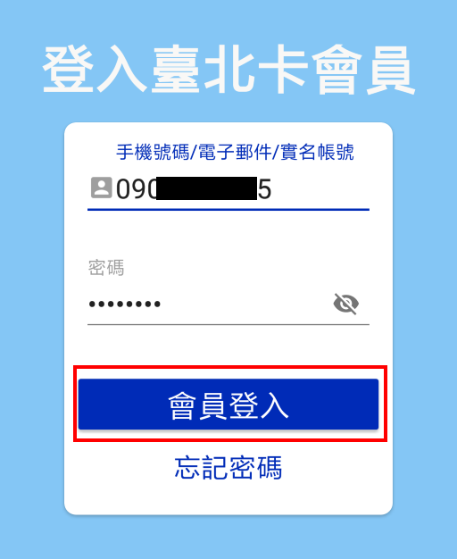

### 2.一般會員升級金質會員提示，可使用電信驗證方式升級為金質會員

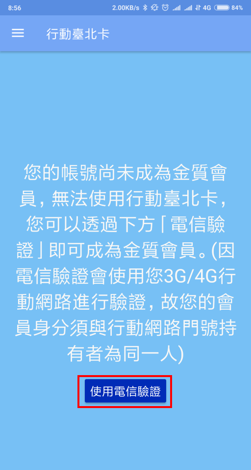

### 3.顯示注意事項，點擊【開始驗證】按鈕

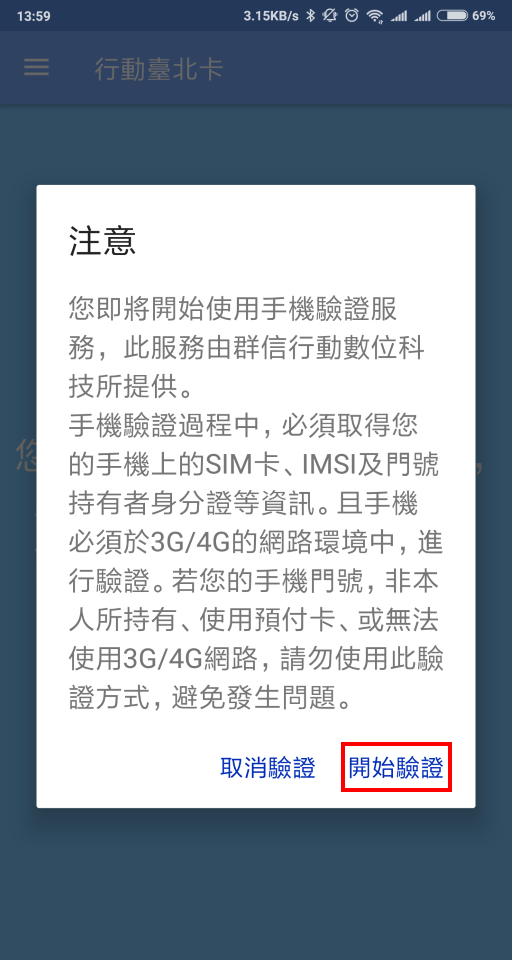

### 4.顯示行動身分識別使用者同意書，請按下【我同意】按鈕。

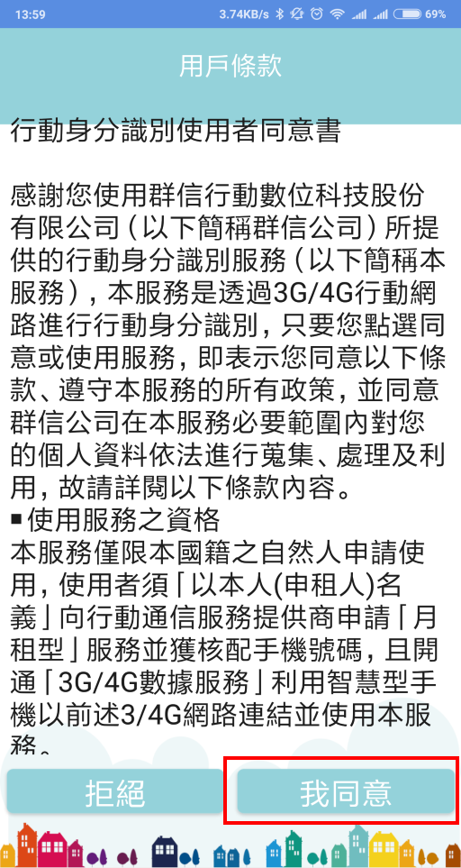

### 5.電信驗證需要使用3G/4G網路進行驗證 若使用的網路為WIFI會彈出下列訊息 

#### ※若手機使用雙門號，驗證時需要選擇對應的網路， 例如： 

#### 1. 中華電信的門號就要選擇中華電信的3G/4G網路

####  2. 台灣大哥大的門號就要選擇台灣大哥大的G/4G網路

####  3. 遠傳電信的門號就要選擇遠傳電信的G/4G網路

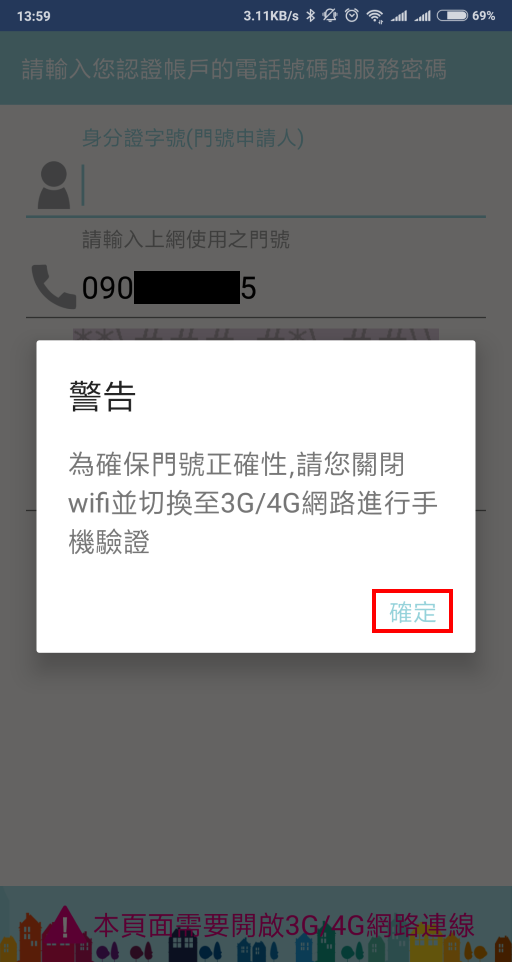

### 6.輸入認證帳戶的身分證字號/上網使用的門號/驗證碼，按下【驗證資料】按鈕

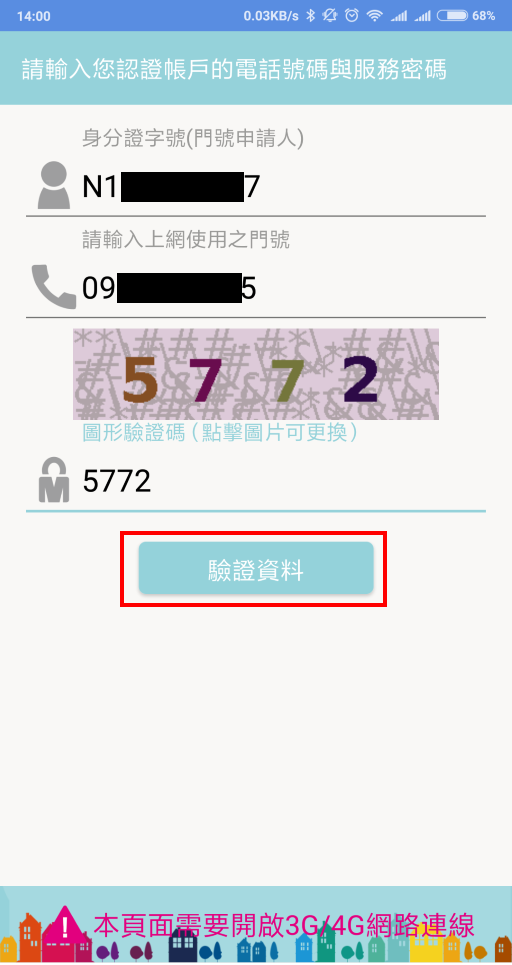

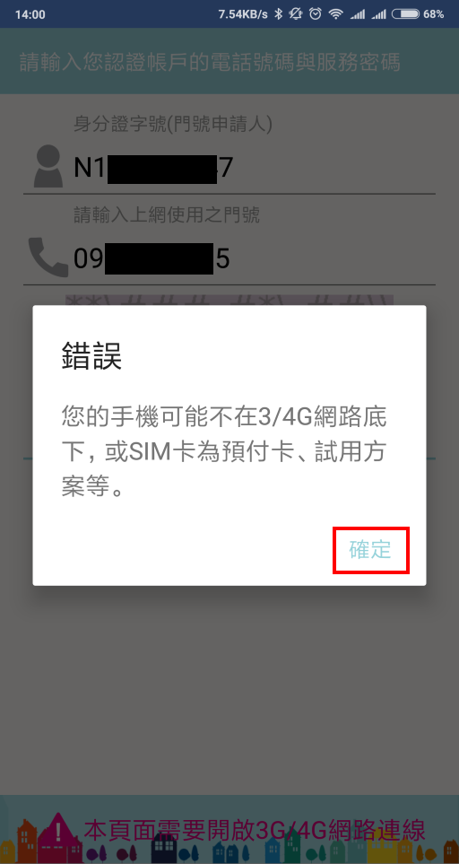

### 7.驗證成功，成為金質會員，會顯示實名帳號 

### ※仍可使用一般會員申請時的帳號登入\(手機號碼或電子郵件\)

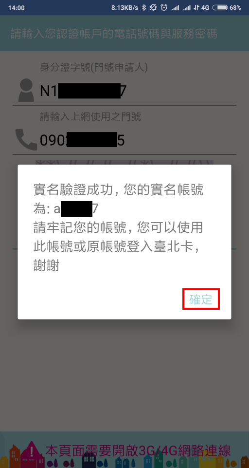

### 8.申請行動臺北卡，點選”+”符號按鈕

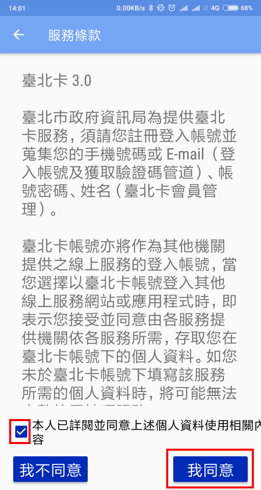

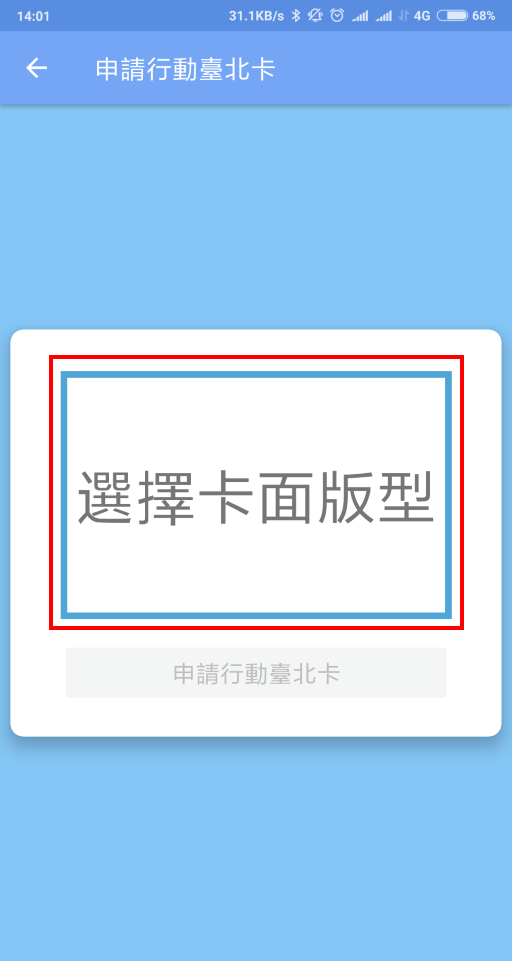

### 9.金質會員申請好行動臺北卡後，顯示行動臺北卡和擁有的卡證服務

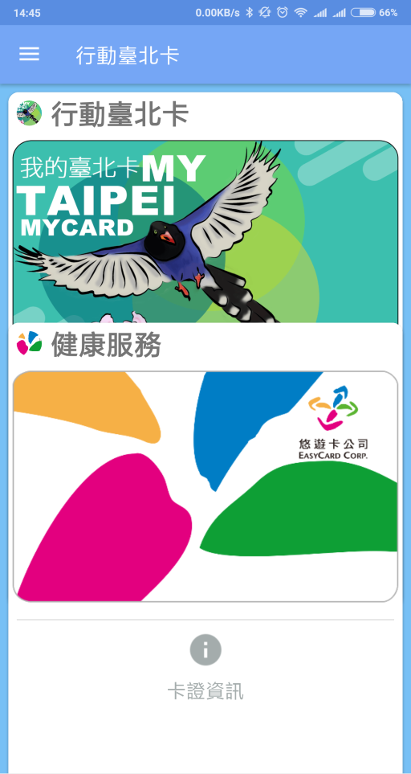

