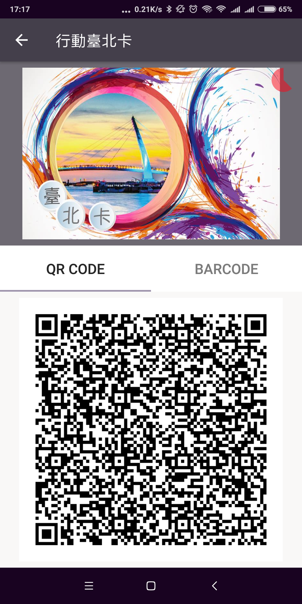

# 台北卡3.0會員身份驗證方式及步驟

## 1.登入會員端行動台北卡App

輸入手機號碼/電子郵件/實名帳號，並輸入密碼後點擊『登入』按鈕。

## 2.會員端App顯示QR Code

點擊『QR Code』App顯示QR Code圖片

## 3.驗證App掃會員App QR Code驗證會員身分

使用台北卡QRCode驗證App 掃描會員App顯示的QR Code

##  4.驗證端App顯示會員資料和綁定服務

顯示個人資訊、會員等級和持有卡片

##  

