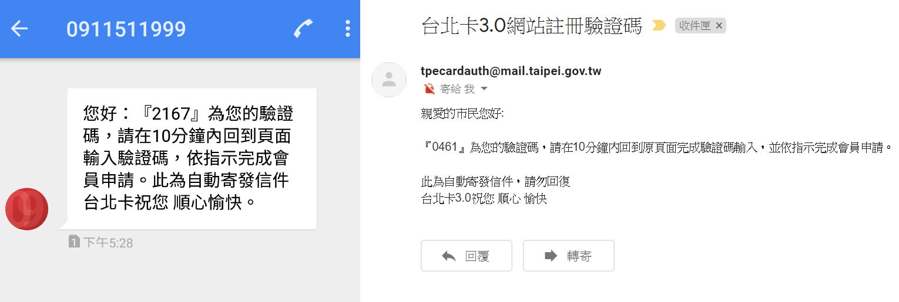
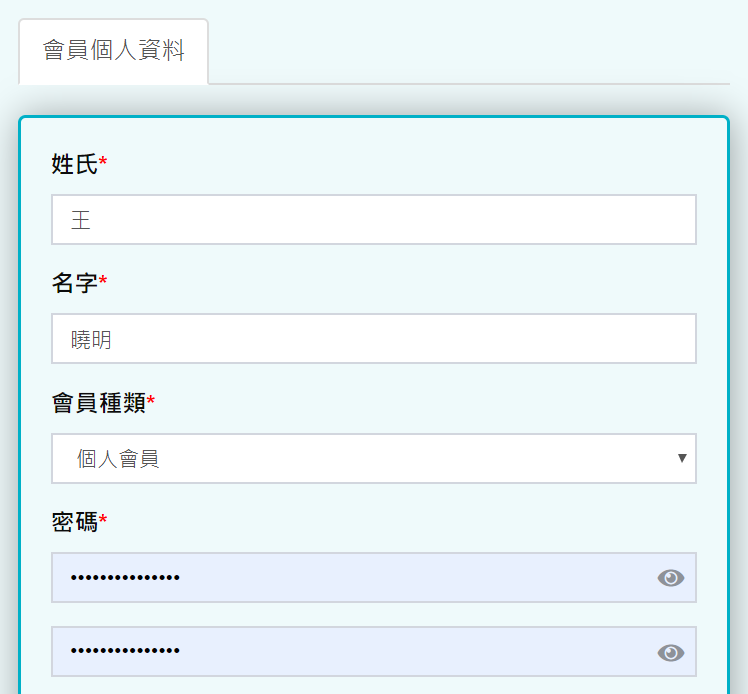

# 台北卡3.0一般會員申請步驟

## 台北卡3.0一般會員申請步驟 

### 1. 在電腦上打開瀏覽器，連上[台北卡網站](https://id.taipei/tpcd) ，滑鼠點擊右上方桃紅色按鈕 \[申請台北卡\] 

​

### 2. 點擊 \[一般會員註冊\] 選擇成為一般會員 

※ [一般會員與金質會員有何不同 ?](https://tpcdservice.gitbook.io/tpcdcardqa/yi-ban-v.s.-jin)

### 3.一般會員註冊頁面，請在此詳閱個資使用相關內容，打勾後按 \[下一步\]

### 4.在這裡可以選擇使用手機號碼或電子郵件註冊

* 手機號碼註冊，輸入手機號碼後，按下藍色 \[寄送驗證碼簡訊\] 。
* 電子郵件註冊，輸入電子郵件後，按下藍色 \[寄送驗證碼電子郵件\] 。

### 5.檢查是否收到驗證碼訊息

* 手機號碼註冊，請至您的手機查看是否有新的簡訊。
* 電子郵件註冊，請登入您的電子郵件信箱檢查是否有新的電子郵件。

※未收到驗證訊息，請稍等片刻，若遲遲未收到，您可以按 \[再次取得驗證碼\] ，系統將重新傳送驗證訊息給您。

### 6.輸入驗證碼後，請勾選 \[我不是機器人\]，再按 \[下一步\] 。

### ​7.請填寫您的基本資料。

### 8.請依據提示的規則設定密碼後按 \[註冊\]

### 9.註冊完成後您可以按 \[是，下一步\] 繼續進行金質會員認證，或 \[否，自動登入台北卡3.0網站\] 直接進入臺北卡網站。

### 10.若您上一步選擇 \[否，自動登入台北卡3.0網站\]，您將被導入台北卡網站如下圖

※**卡片上出現綠色打勾符號表示您已開通該卡證服務，若您想申辦未開通的服務，請點選該服務後檢視「如何申請」之說明。**

