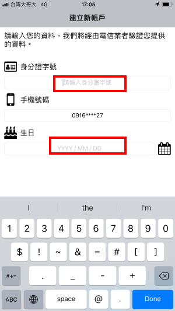

# 臺北卡3.0一般會員申請步驟

## 臺北卡3.0一般會員申請步驟 

### 1. 在電腦上打開瀏覽器，連上臺北卡網站\[https://id.taipei/tpcd\]，滑鼠點擊桃紅色按鈕\[申請臺北卡\] 

​

### 2. 點擊\[一般會員註冊\]選擇成為一般會員 

一般會員與金質會員有何不同 ? 請參考

### 3.一般會員註冊頁面，請在此詳閱個資使用相關內容，打勾後按\[下一步\]

### 4.在這裡可以選擇用手機號碼或電子郵件註冊，以手機號碼註冊為例，輸入手機號碼後，按下藍色\[寄送驗證碼簡訊\]

### 5.檢查您的手機是否收到簡訊，或是您選擇電子郵件認證的話，請登入您的電子郵件信箱檢查是否有新的電子郵件。

### 6.在臺北卡網站上，輸入手機簡訊裡的驗證碼後，請勾選\[我不是機器人\]，再按灰色鍵下一步。

### ​7.請填寫您的基本資料，如果您曾為網路市民會員，請在此按\[取回網路市民資料\] 。以下的案例不從網路市民帶入資料。

### 8.依據提示的規則設定密碼後按註冊。

### 9.註冊完成後您可以按\[是\]在此繼續進行金質會員認證，或\[否\]直接進入到臺北卡網站。

### 10.若您上一步選則\[否\]，則您將被導入臺北卡網站如下圖

