# 如何綁定和解除悠遊卡

## 台北卡3.0官網\(一般會員或金質會員\)

### 1.綁定卡片：於【悠遊卡管理】輸入自訂的\[悠遊卡別名\]、悠遊卡卡號、若有\[電子發票驗證碼\]可一併輸入，點擊右邊的\[+\]符號後，系統檢核無誤，就會綁定悠遊卡。

#### 點選悠遊卡管理，下面會出現如何查詢卡號的說明。

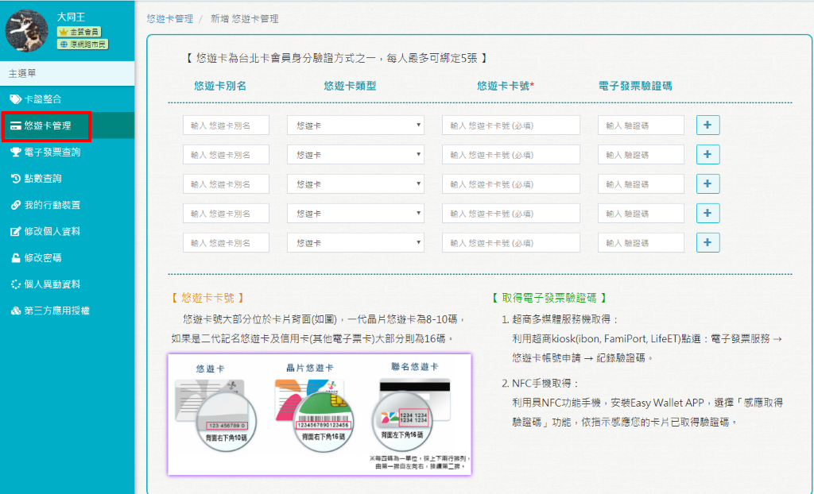

#### 輸入悠遊卡別名、卡號，並按下 \[+\]符號按鈕。

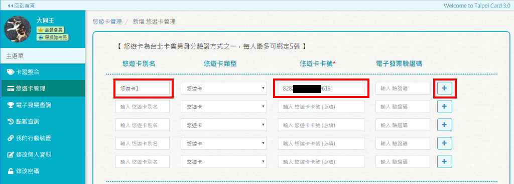

#### 顯示提示訊息，需要加上電子發票查詢功能才需要填入驗證碼\(可事後加\)

#### 加入完成\(此悠遊已綁定台北卡\)

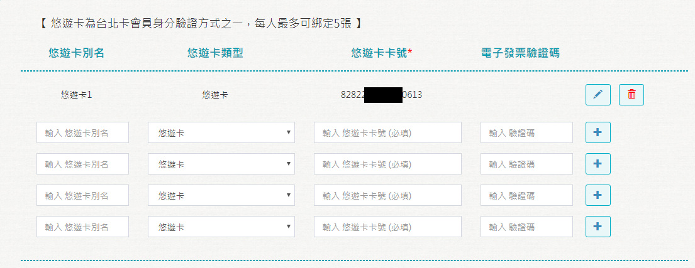

### 2.修改：點擊悠遊卡右邊的\[筆\]符號後，可修改\[卡片別名\]或\[電子發票驗證碼\]。

#### 輸入發票驗證碼

### 3.解除綁定：點擊悠遊卡右邊的\[垃圾桶\]符號後，可解除該張卡片與帳號的綁定。

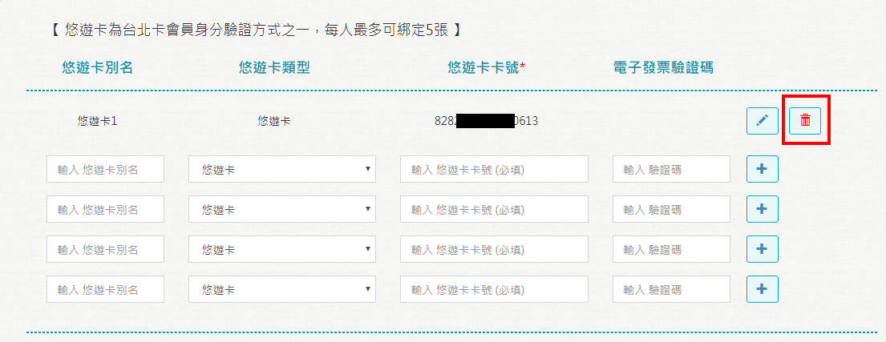

### 4.電子票查詢：有輸入電子發票驗證碼，可使用【電子發票查詢】功能，點選悠遊卡最右邊的\[查詢發票清單\]按鈕後，會顯示\[發票開始日期\]和\[發票結束日期\]，選取區間後，點擊\[查詢\]按鈕，就會顯示電子發票清單和\[是否捐贈\]。

#### 輸入查詢日期區間，並按下查詢按鈕

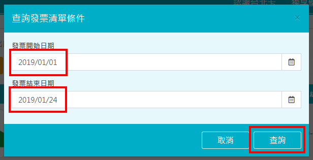

#### 顯示查詢結果，點選右邊的查詢發票明細，可查閱消費明細

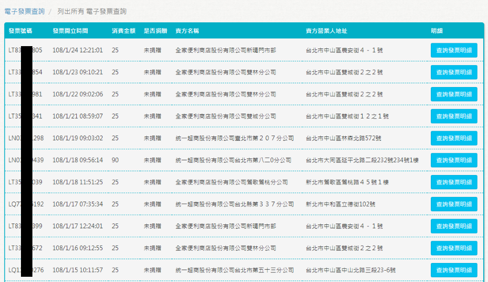

### 5.電子發票驗證碼：可至ibon的【生活】的【電子發票】進行查詢作業，相關操作請參考[網址](https://www.ibon.com.tw/operate.aspx?fromPage=life.aspx&routeIDListInfo=4;F021;0,7,39,106#gsc.tab=0)。

## 行動台北卡App\(一般會員或金質會員\)

### 1.綁定卡片：登入行動臺北卡&gt;&gt;選擇【會員中心】&gt;&gt;悠遊卡管理，點擊左下角的 \[+\]，輸入自訂的\[悠遊卡別名\]、[外碼卡號](可至官方網站查看號碼順序)，點擊\[綁定悠遊卡\]後，完成綁定。

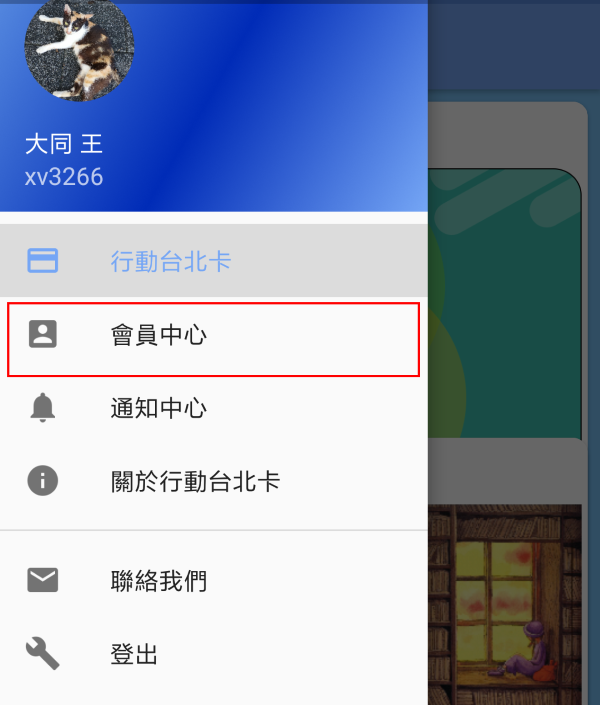

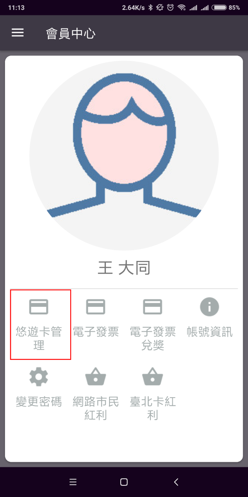

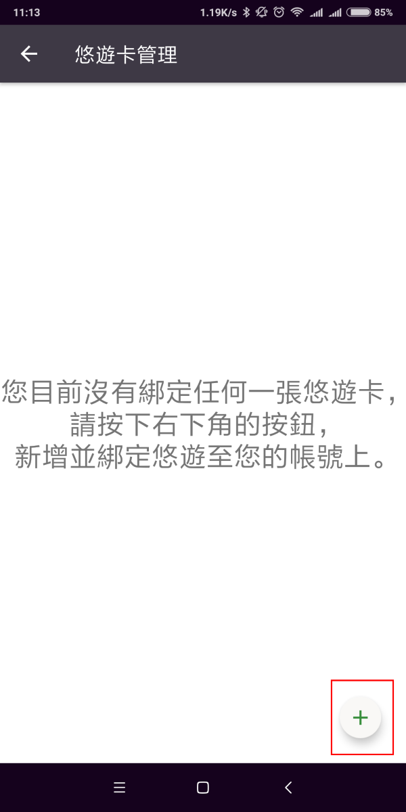

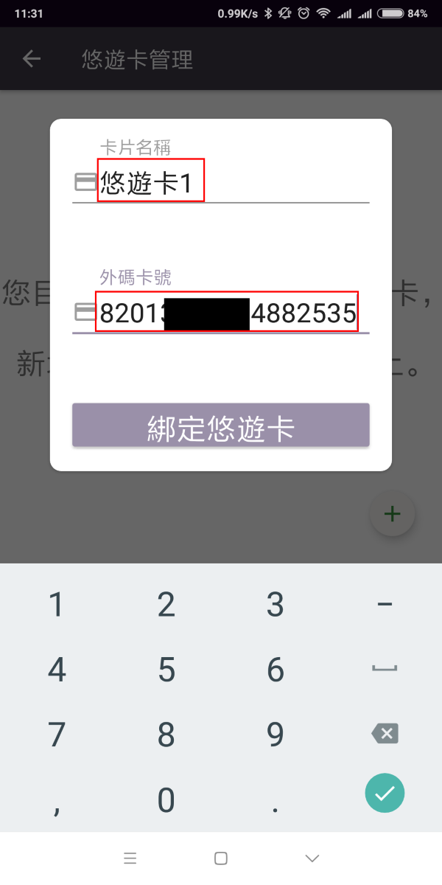

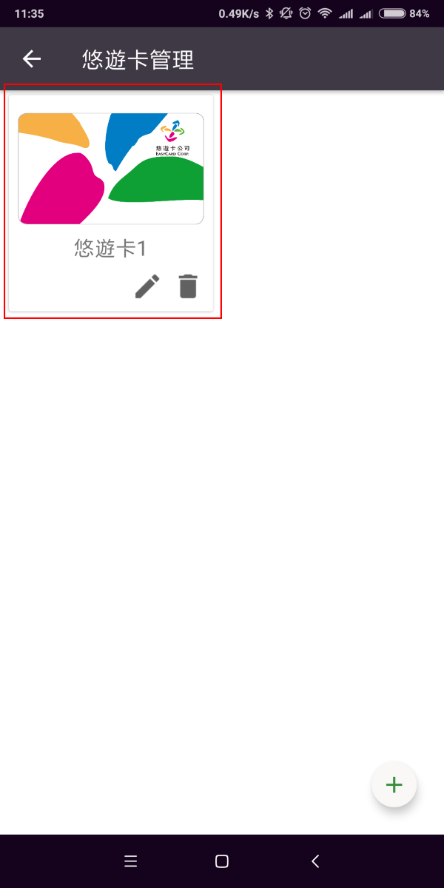

### 2.修改：點擊悠遊卡下方的\[筆\]符號後，可修改\[卡片名稱\]或\[電子發票驗證碼\]，點擊\[更新\]按鈕後完成修改。

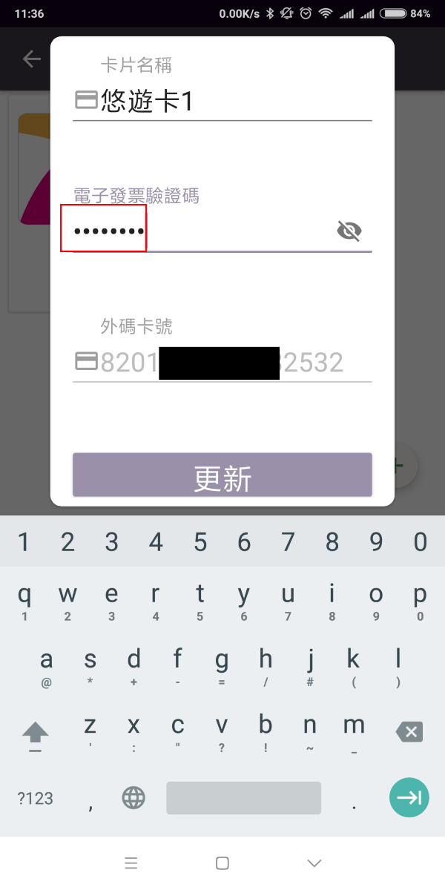

### 3.解除綁定：點擊悠遊卡下方的\[垃圾桶\]符號後，可解除該張卡片與帳號的綁定。

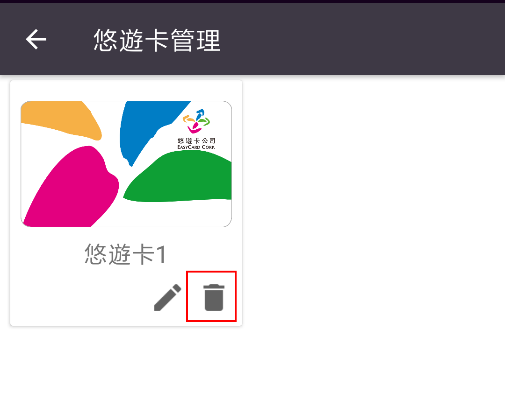

### 4.電子票查詢：有輸入電子發票驗證碼，可使用【會員中心】的【電子發票查詢】功能，預設會顯示近一週的電子發票清單。

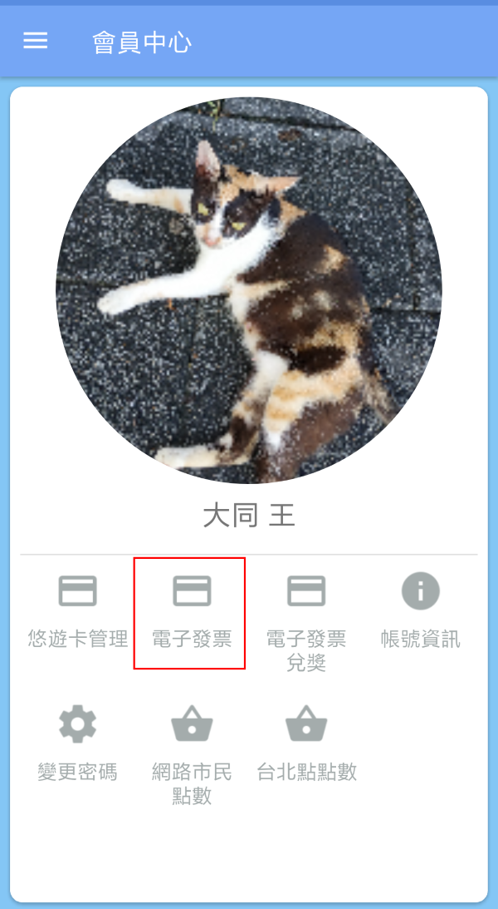

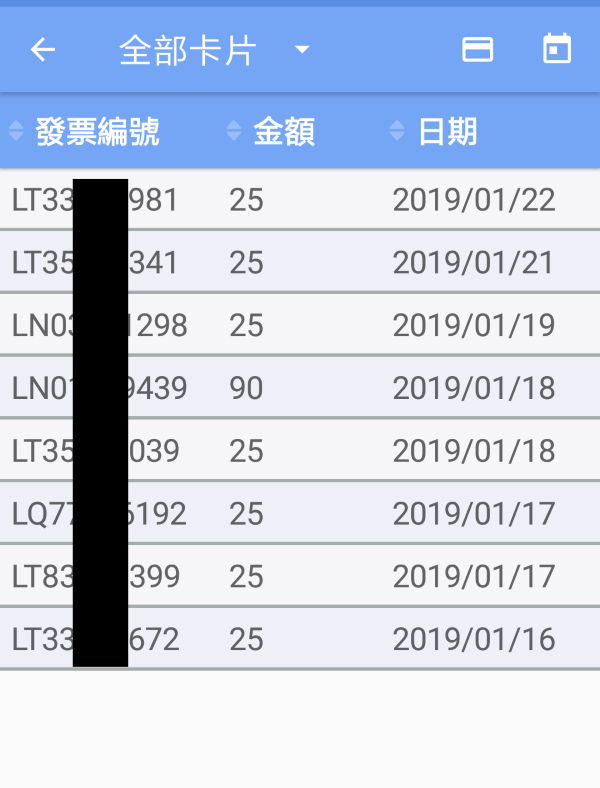

