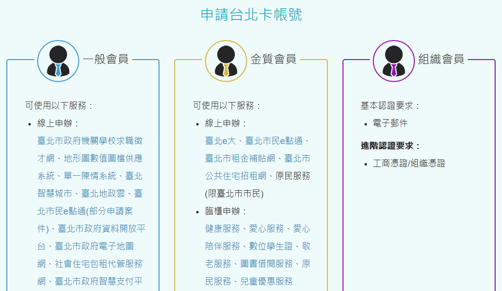
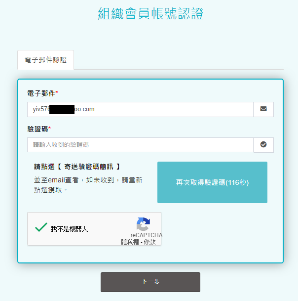

# 如何註冊和登入組織會員

## 台北卡3.0組織會員申請步驟

### 1.在電腦上打開瀏覽器，連上台北卡網站 \[ [https://id.taipei/tpcd](https://id.taipei/tpcd) \]，滑鼠點擊畫面右方桃紅色\[申請台北卡\]按鈕

### 2.點擊\[組織會員\]註冊

### 3.請詳閱個資使用相關內容，打勾後按\[下一步\]

4.在此輸入電子郵件進行註冊，按下\[藍色寄送驗證碼\]按鈕，會寄送驗證碼到輸入的電子郵件，並將我不是機器人打勾，按下\[下一步\]按鈕。\(若未收到驗證碼，需要120秒後才能重送驗證碼\)。

#### fffffffa

## Have you had a chance to answer the previous question?

Yes, after a few months we finally found the answer. Sadly, Mike is on vacations right now so I'm afraid we are not able to provide the answer at this point.

