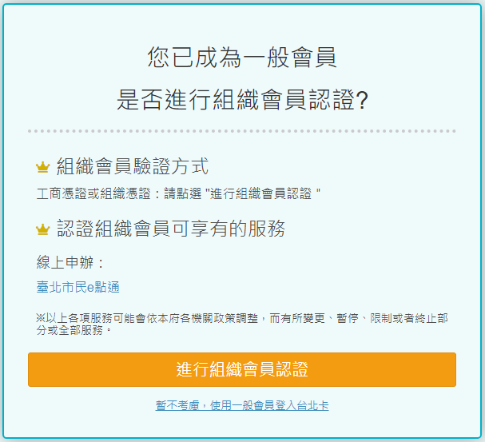

# 如何註冊和登入組織會員

## 台北卡3.0組織會員申請步驟

### 1.在電腦上打開瀏覽器，連上[台北卡網站](https://id.taipei/tpcd) ，滑鼠點擊右上方桃紅色按鈕 \[申請台北卡\]

### 2.點擊\[組織會員\]註冊

### 3.請詳閱個資使用相關內容，打勾後按 \[下一步\]

4.在此輸入電子郵件進行註冊，按下 \[藍色寄送驗證碼\] 按鈕，會寄送驗證碼到輸入的電子郵件，並將我不是機器人打勾，按下 \[下一步\] 按鈕。

※若未收到驗證碼，需要120秒後才能重送驗證碼。

### 5.請填寫組織的基本資料

### 6.註冊完成後您可以按 \[進行組織會員認證\] 繼續進行組織會員認證，或 \[暫不考慮，使用一般會員登入台北卡\] 直接進入臺北卡網站。

### 7.若您上一步選擇 \[進行組織會員認證\] 即可繼續組織會員的認證 ；若您選擇 \[暫不考慮，使用一般會員登入台北卡\] ，您可按台北卡左邊選單中的 \[組織會員驗證\] 進行組織會員的認證

### 8.請依照說明下載安控元件

### 9.請按 \[下一步\] 以繼續

### 10.若您接受授權協議便請按 \[下一步\] 以繼續安裝

### 11.安裝完畢，請按 \[完成\] 以關閉安裝精靈

### 12.右下角的安控元件從 \[Loading\] 轉成 \[Ready\]，此時請按鍵盤上 \[F5\] 鍵以刷新網頁

### 13.安控元件安裝並啟動成功後，點選 \[下一步\]

### 14.步驟二，請插入工商憑證或組織憑證，並按下 \[送出\]

### 15.網站上會跳出 PINCODE 輸入框，請輸入工商憑證或組織憑證 PINCODE

### 16.完成組織會員認證後，您可以透過台北卡組織會員的 \[憑證登入\] 進入台北卡的會員頁面

### 17.請輸入工商憑證或組織憑證 PINCODE

### 18.登入後，您可以看到左上角已顯示目前您為組織會員

### 19.在個人資料部分會提醒您，您以為組織會員，往後登入請使用工商憑證或組織憑證進行登入

## Have you had a chance to answer the previous question?

Yes, after a few months we finally found the answer. Sadly, Mike is on vacations right now so I'm afraid we are not able to provide the answer at this point.

