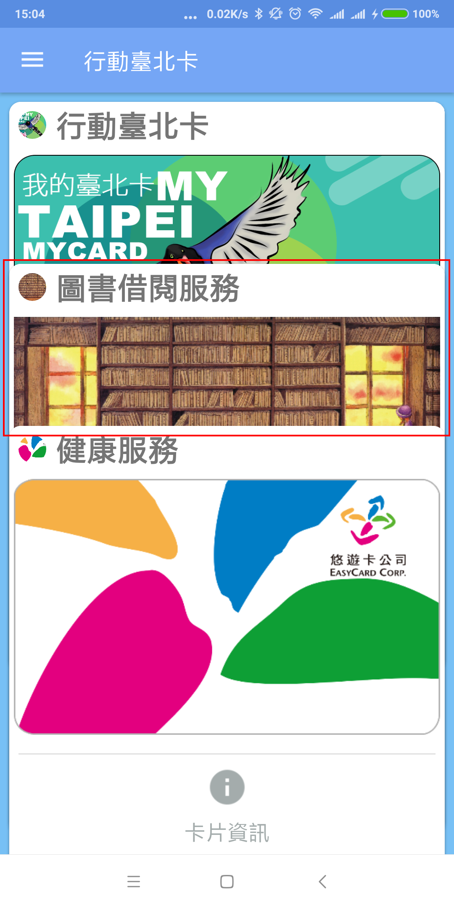

# 台北卡3.0會員服務綁定方式與步驟

## 台北卡3.0會員服務綁定

###  一、要對應到卡證服務，會員等級需為金質會員

### 二、目前金質會員開通後，就會綁定健康服務

### 三、各項服務都是由各機關提供的，可參考各卡證服務的申請說明進行申請，未開通的服務皆是以灰色顯示卡面。以『臺北市立圖書館借閱服務』為例，尚未綁定為灰色圖片。

### 四、要申請時，點選『臺北市立圖書館借閱服務』圖片，選擇如何申請的頁面，依據申請方式說明進行申請。

### 五、申請完成後，臺北市立圖書館會將資料傳到臺北卡3.0，就會綁定服務，圖片顏色變成彩色，且出現綠色勾選符號，且行動臺北卡App也會顯示這張卡片。

### 六、若服務僅想在網頁上顯示，不在行動台北卡App上顯示，可在卡片下方的開關設為Off，行動台北卡就不顯示服務卡面

  

  

