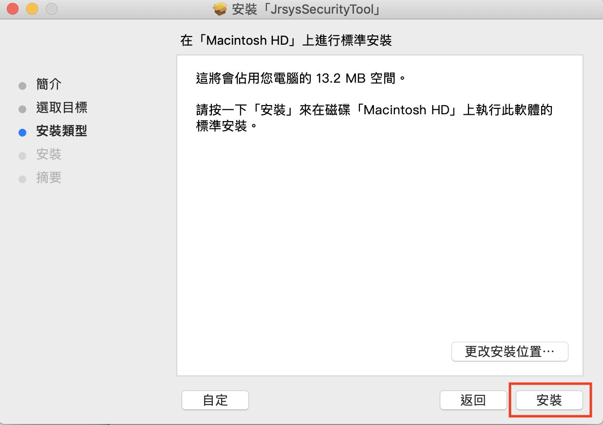
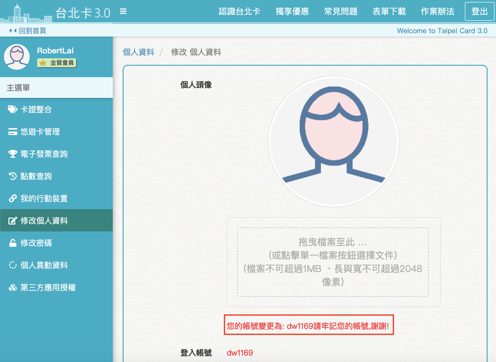

# MAC安控元件安裝

### 1.下載安控元件

### 2.點擊已下載的安控元件安裝執行檔

### 3.會出現以下信息

### 4.請至系統設定偏好

### 5.選擇 \[安全性與隱私權\]

### 6.下方選擇 \[強制打開\]

### 7.點選 \[繼續\]

### 8.按 \[安裝\]

### 9.請輸入您的管利者名稱及密碼，並按下 \[安裝軟體\]

### 10.安裝成功，請點選 \[關閉\]

### 11.啟動安控元件，輸入您的管理者帳密

### 12.安控元件安裝並啟動成功後，點選 \[下一步\]

### 13.步驟二，使用讀卡機插上自然人憑證且USB插在電腦上\(請確認讀卡機運作正常\)，輸入正確的身份證字號後按橘色鍵 \[送出\]

### 14.若讀卡機以及自然人憑證運作正常，網站上會跳出 PINCODE 輸入框，請輸入自然人憑證 PINCODE，並按下 \[確認\]

### 15.驗證成功後，您會得到一組帳號，密碼仍是您原來設的密碼

* 已驗證為金質會員，姓名下方顯示金色皇冠和金質會員字樣。
* 多了一個帳號可供登入，仍可使用原本註冊的手機或郵件帳號登入。

