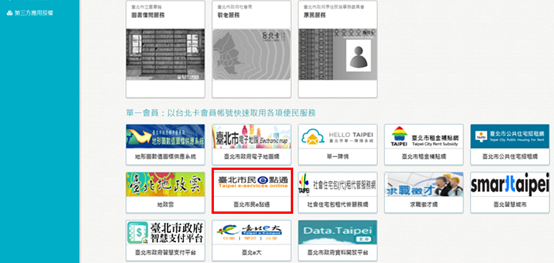
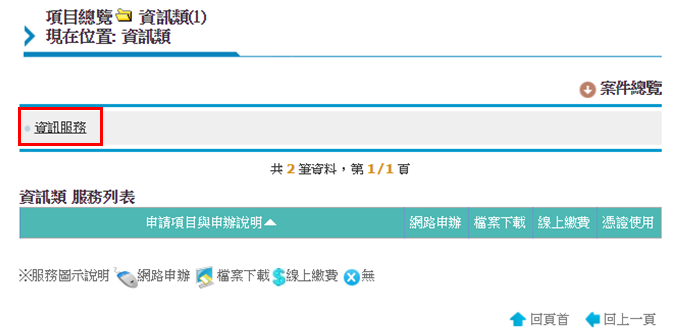
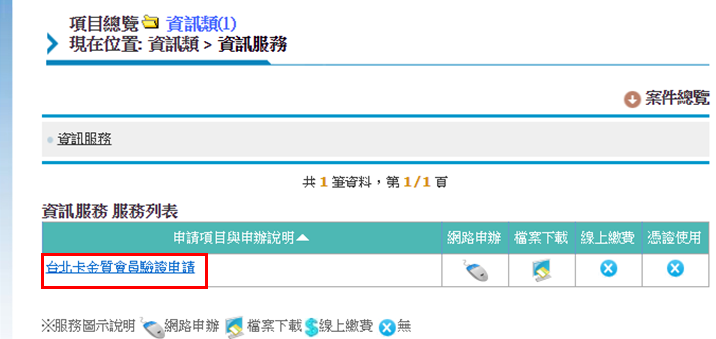
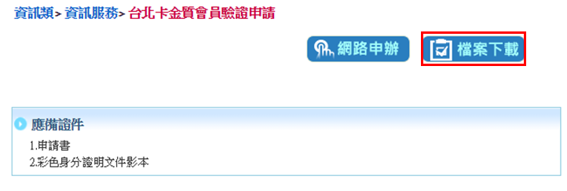
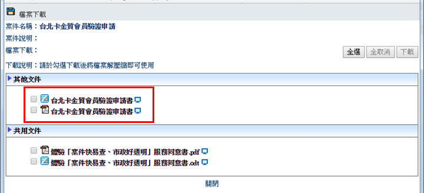
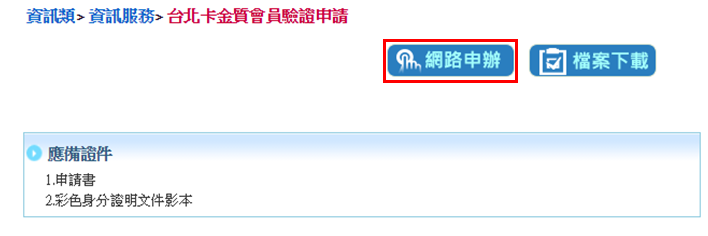

# 線上申請台北通金質會員驗證步驟

## 1.在電腦上打開瀏覽器，連上台北卡網站

連上[台北卡網站](https://id.taipei/tpcd)，並登入會員， 點選市民服務大平臺

## 2.如為第一次進入市民服務大平臺，需再點選\[台北卡會員登入\]

## 3.選擇\[資訊類\]- \[資訊服務\]- \[台北卡金質會員驗證申請\]

## 4.選擇\[檔案下載\]

## 5.下載並填妥申請書

## 6.點選\[網路申辦\]

## 7.上傳申請書及身分證明文件後，點選\[下一步\]並送出申請

