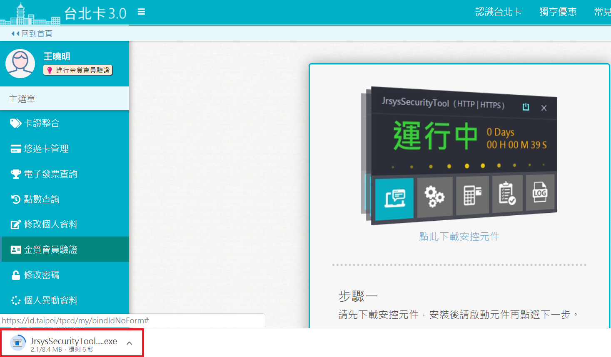
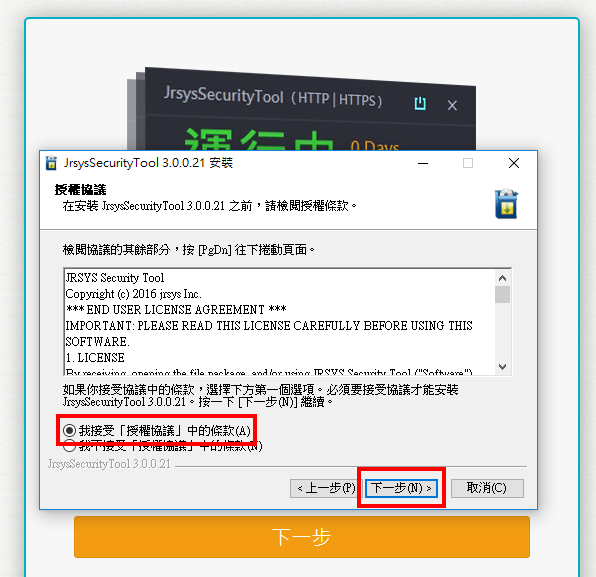
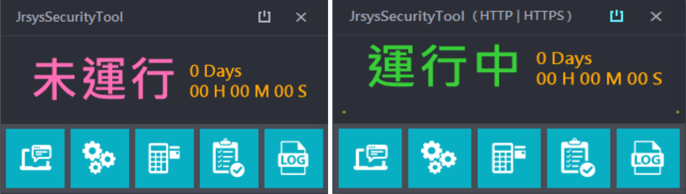
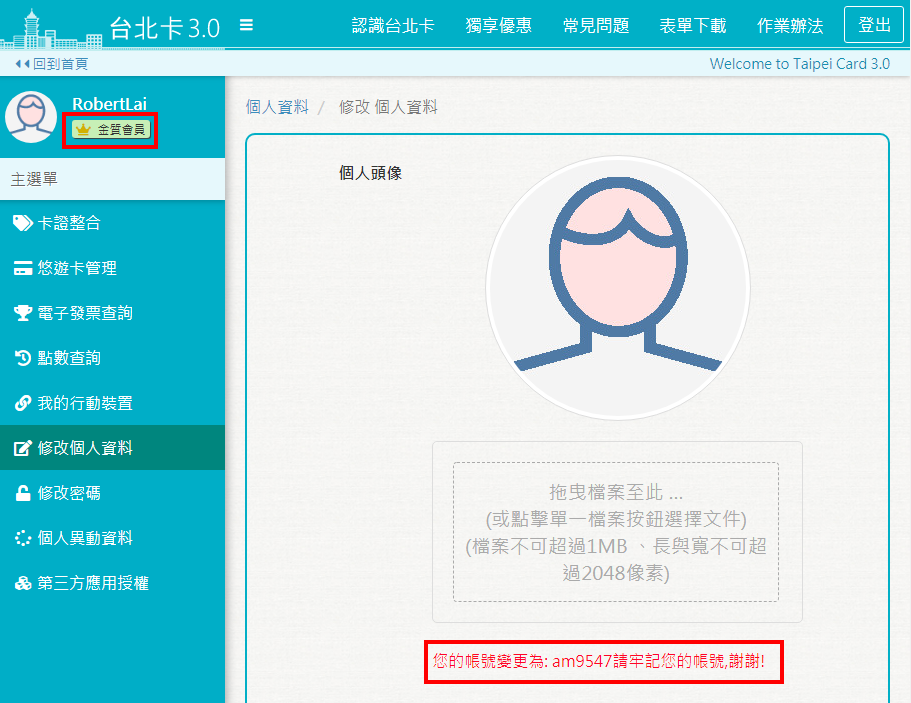

# 一般會員升級金質會員

## 方式1.使用自然人憑證升級為金質會員

###  step1 使用者透過線上認證\(手機帳號認證、電子郵件認證\)或經由手機安裝 \[行動台北卡\] 應用程式註冊成為一般會員。

###  step2 使用者以一般會員身分登入系統，在個人資料維護功能裡，點擊 \[金質會員認證\] ，透過 自然人憑證認證升級成金質會員。

####  1.進行金質會員認證

#### 2.選擇驗證方式

* 點選 \[手機驗證\] 會彈出說明請使用 \[行動台北卡\] APP進行電信驗證
* 點選 \[線上轉成金質會員\] 會開啟 \[市民服務大平臺\] 網站中 \[台北通金質會員驗證申請 \]的網頁

#### 3.下載安控元件

※若您為MAC使用者，請參考 [MAC安控元件安裝](https://tpcdservice.gitbook.io/tpcdcardqa/tai-bei-ka-3.0-jin-zhi-hui-yuan/mac-an-kong-yuan-jian-an-zhuang)

####  4.安裝安控元件 

#### 5.請按 \[下一步\] 以繼續

#### 6.若您接受授權協議便請按 \[下一步\] 以繼續安裝

#### 7.安裝完畢，請按 \[完成\] 以關閉安裝精靈

#### 8.右下角的安控元件從 \[未運行\] 轉成 \[運行中\]，此時請按鍵盤上 \[F5\] 鍵以刷新網頁

####  9.安控元件安裝並啟動成功後，點選 \[下一步\]

####  10.輸入身分證字號

#### 11.若讀卡機以及自然人憑證運作正常，網站上會跳出 PINCODE 輸入框，請輸入自然人憑證 PINCODE

####  12.成功升級為金質會員

* 已驗證為金質會員，姓名下方顯示金色皇冠和金質會員字樣。
* 多了一個帳號可供登入，仍可使用原本註冊的手機或郵件帳號登入。

## 方式2.臨櫃作業：透過臨櫃服務人員協助，升級金質會員

###  使用者到區公所及台北卡整合之各項服務申辦窗辦理，提供相關文件證明，透過臨櫃服務人員協助申請註冊為金質會員。

## 方法3.電信驗證：透過電信實名驗證，升級金質會員

#### 使用者需準備屬於個人申辦的手機號碼，依照行動台北卡App的指示逐步進行電信驗證，詳細內容請參考台北卡3.0電信實名驗證

※詳細步驟請參考 [台北卡3.0電信實名驗證](https://tpcdservice.gitbook.io/tpcdcardqa/tai-bei-ka-3.0-jin-zhi-hui-yuan/bei-ka-3.0-qun-xin)

## 方法4.市民服務大平臺驗證：透過市民服務大平臺，升級金質會員

使用者需要準備身分證明文件，依據網頁指示填寫相關資料，並將身分資料上傳，由人工進行審核，敬請耐心等待申請完成。

※詳細步驟請參考 [市民e點通申請臺北卡金質會員驗證步驟](https://tpcdservice.gitbook.io/tpcdcardqa/tai-bei-ka-3.0-jin-zhi-hui-yuan/shi-minetong-shen-bei-ka-jin-bu)



