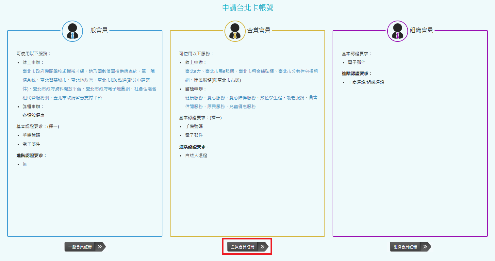
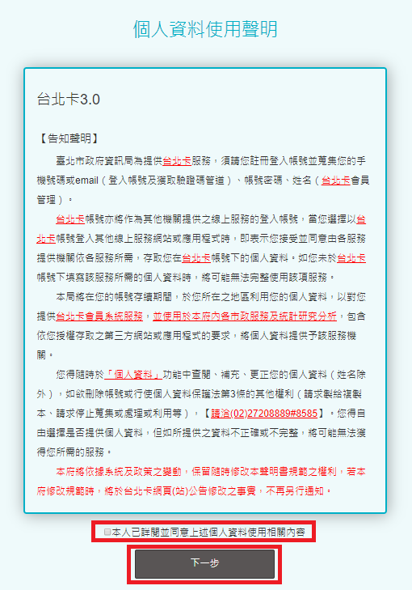
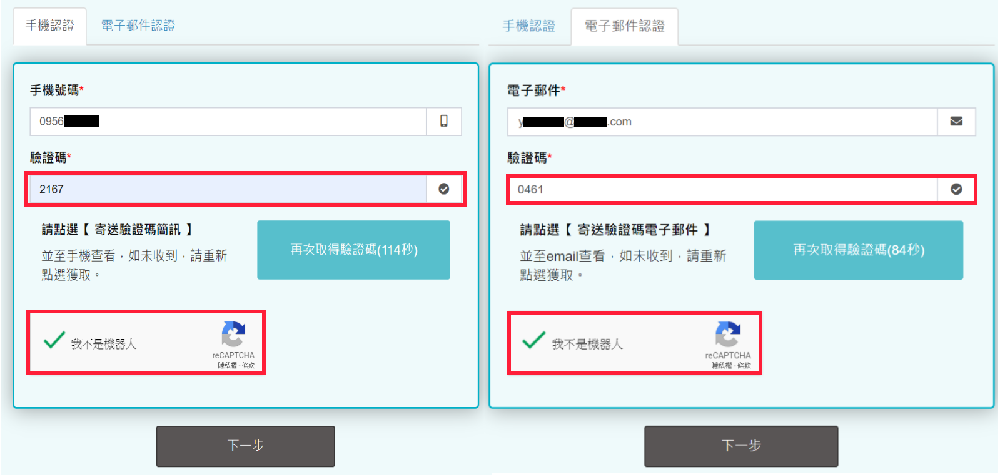
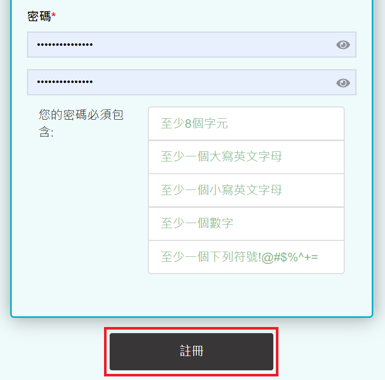

# 台北卡3.0金質會員申請步驟

## 台北卡3.0金質會員申請步驟 

### 1.在電腦上打開瀏覽器，連上[台北卡網站](https://id.taipei/tpcd) ，滑鼠點擊右上方桃紅色按鈕 \[申請台北卡\] 

​

### 2. 點擊\[金質會員註冊\]選擇成為金質會員 

### 3.會員註冊頁面，請在此詳閱個資使用相關內容，打勾後按\[下一步\] 

​

### 4.在這裡可以選擇使用手機號碼或電子郵件註冊 

* 手機號碼註冊，輸入手機號碼後，按下藍色 \[寄送驗證碼簡訊\] 。
* 電子郵件註冊，輸入電子郵件後，按下藍色 \[寄送驗證碼電子郵件\] 。

### 5.檢查是否收到驗證碼訊息 

* 手機號碼註冊，請至您的手機查看是否有新的簡訊。
* 電子郵件註冊，請登入您的電子郵件信箱檢查是否有新的電子郵件。

### 6.輸入驗證碼後，請勾選 \[我不是機器人\]，再按 \[下一步\]  

### ​7.請填寫您的基本資料 

### 8.請依據提示的規則設定密碼後按 \[註冊\] 

### 9.註冊完成後您可以按 \[進行金質會員認證\] 在此繼續進行金質會員認證，或 \[暫不考慮，使用一般會員登入台北卡\] 直接進入到台北卡網站。在此請選擇 \[進行金質會員認證\] 以繼續進行金質會員認證 

### 10.請依照說明下載安控元件，並進行驗證

※詳細步驟請參考 [下載安控元件](https://tpcdservice.gitbook.io/tpcdcardqa/tai-bei-ka-3.0-jin-zhi-hui-yuan/yi-ban-sheng-jin#3-xia-zai-an-kong-yuan-jian)

