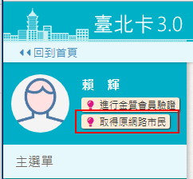
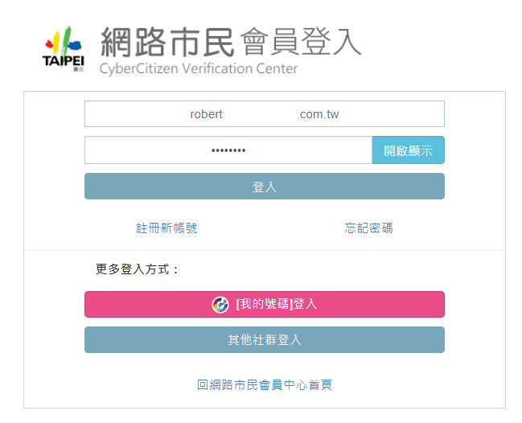
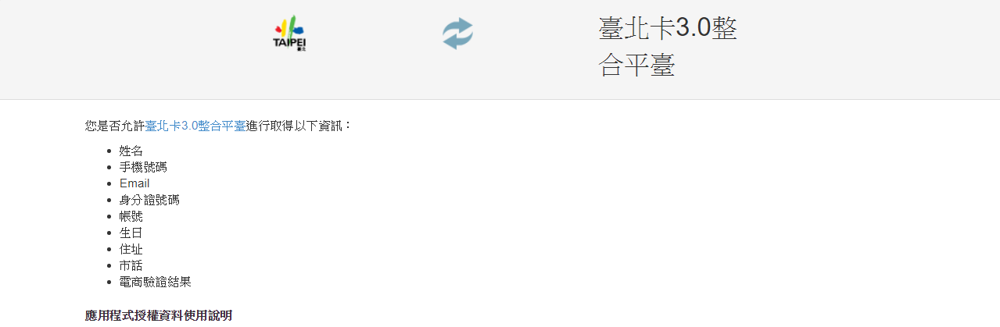
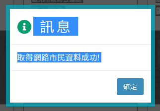

# 網路市民移轉至台北卡3.0

## 申請台北卡會員時取得網路市民資料

### 1. 請按\[申請台北卡\]

### 2. 請選擇註冊為一般會員或金質會員。

### 3.請在此頁選擇\[取回網路市民資料\]

### 4.頁面將帶到網路市民登入，請登入您的網路市民。

### 5.登入網路市民後，請在此頁面按\[允許\]，以同意台北卡3.0取得您網路市民的資料。

### 6.上一頁按允許後，頁面將導回台北卡註冊頁面，並帶入您在網路市民的資料，請繼續設定密碼以完成註冊。

### 7.註冊完成，您可以在此繼續進行金質會員認證或按否自動登入台北卡網站。而您原本於網路市民的資料將與您台北卡的資料綁定在一起。

##  既有會員取得網路市民資料

### 1.點擊取得網路市民按鈕

### 2.網路市民會員登入

### 3.登入網路市民後，請在此頁面按\[允許\]，以同意台北卡3.0取得您網路市民的資料。

###  4.取得網路市民資料成功

###  5.台北卡會員中心畫面

