# 忘記密碼怎麼辦

## 一、使用Web平台時，操作步驟如下：

### 1. 請在臺北卡使用者登入框下方點擊\[忘記密碼\]。

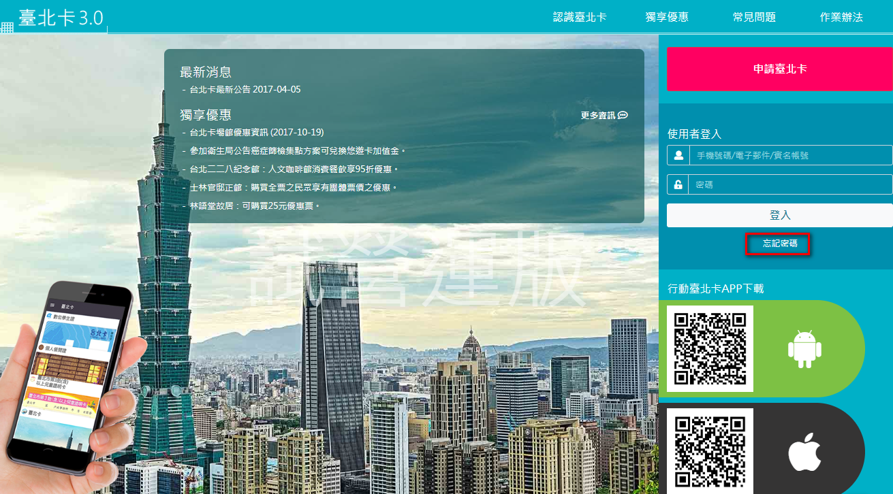

### 2.請選擇取回密碼的方式，可以選擇手機\(如果有\)或電子郵件\(如果有\)的方式。在這裡以手機號碼為例。輸入手機號碼後，按\[送出\]。

#### 若帳號內有設定電子郵件，無論選擇E-Mail或手機號碼輸入，都會透過電子郵件通知。

#### `僅有在帳號單純只有手機號碼時才會發送簡訊。`

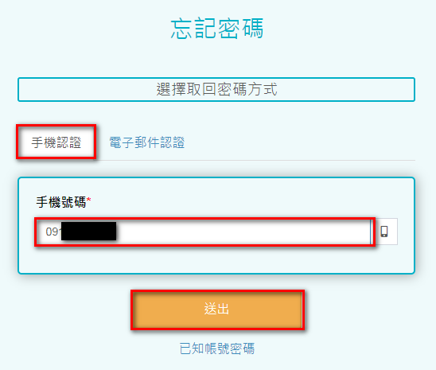

### 3.申請成功，請檢查手機是否收到含有臨時密碼的簡訊。

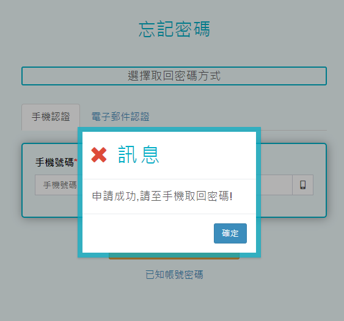

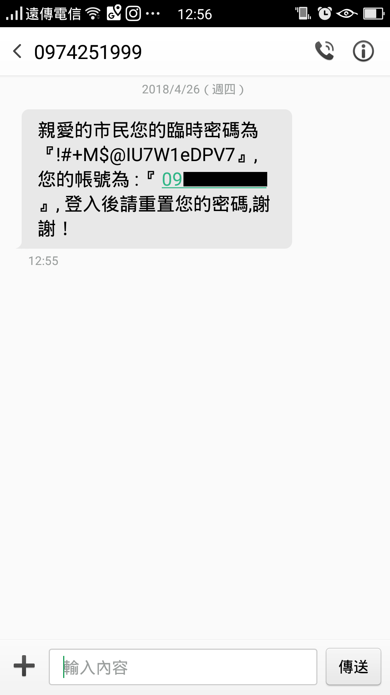

### 4.收到簡訊後，在網頁上按下方的\[已知帳號密碼\]， 回到首頁並以臨時密碼密碼登入。

### ※取得的臨時密碼容易混淆的幾個字，請嘗試可能性：o,O,0、i,I,L,l,1。

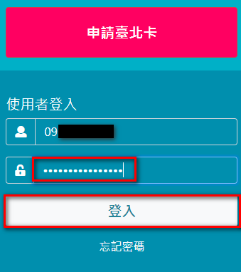

### 5.登入成功後，找到左側功能頁的\[修改密碼\]

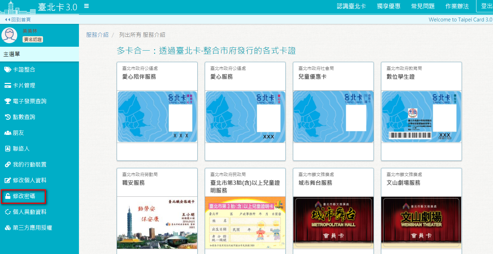

### 6.先輸入原舊密碼，再輸入新密碼兩次，確認新密碼符合規則後按\[送出\]。

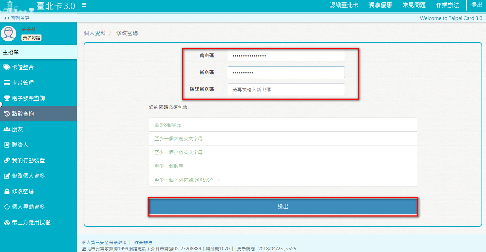

### 7.密碼修改成功後，登出後請用新密碼登入臺北卡系統。

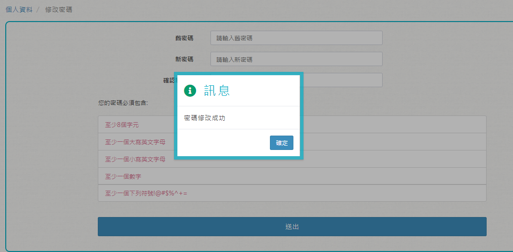

## 二、使用臺北卡行動APP操作步驟如下：

### 1.使用臺北卡行動App，點擊【會員登入】按鈕。

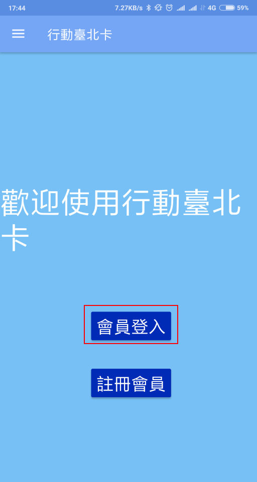

### 2.進入臺北卡會員頁面，點擊【忘記密碼】按鈕。

### 3.可選擇輸入E-Mail/手機號碼，按下【取回密碼】按鈕，通知的規則如下：

#### 若帳號內有設定電子郵件，無論選擇E-Mail或手機號碼輸入，都會透過電子郵件通知。

#### 僅有在帳號單純只有手機號碼時才會發送簡訊。

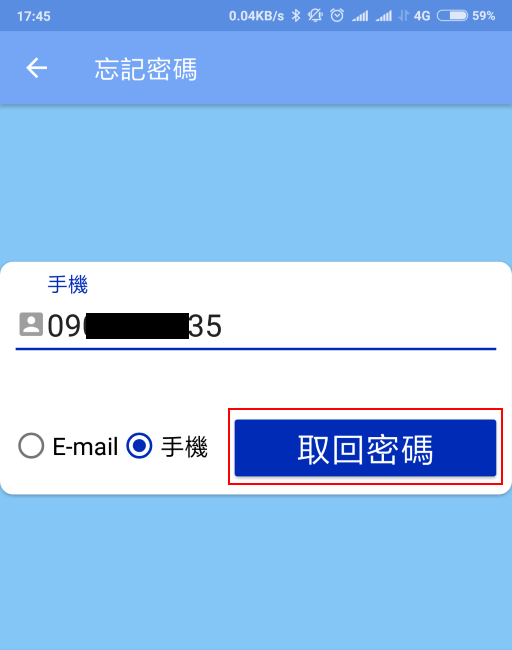

### 4.發出申請成功，請到簡訊或是郵件收取通知。

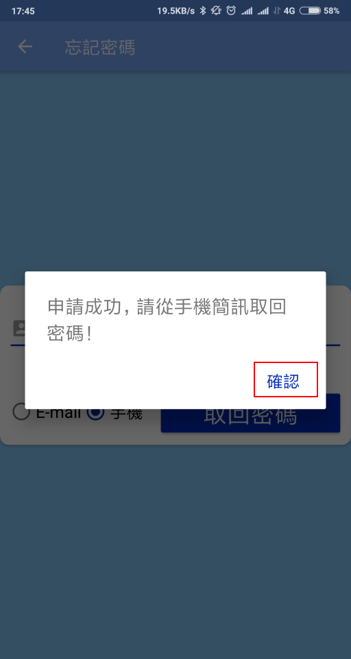

### 5.收到臨時密碼

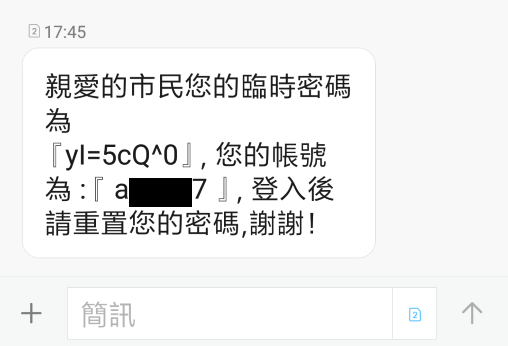

### 6.使用臨時密碼登入臺北卡會員

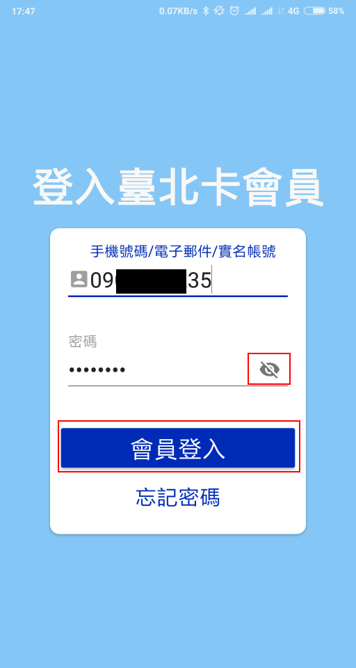

### 7.點擊會員中心的【變更密碼功】能

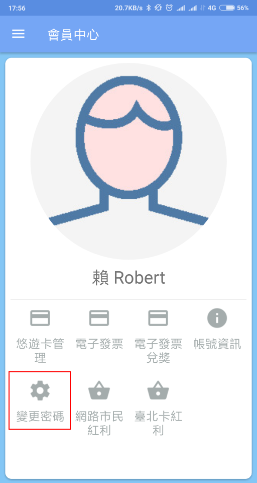

### 8.原始密碼請輸入臨時密碼，新密碼/確認密碼請輸入相同的文字，且要符號提示規則，輸入完成點擊【確定】鈕。

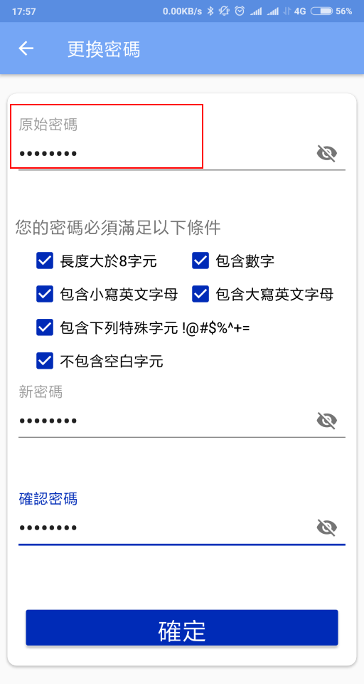

### 9.變更密碼完成，下次登入請使用新密碼。

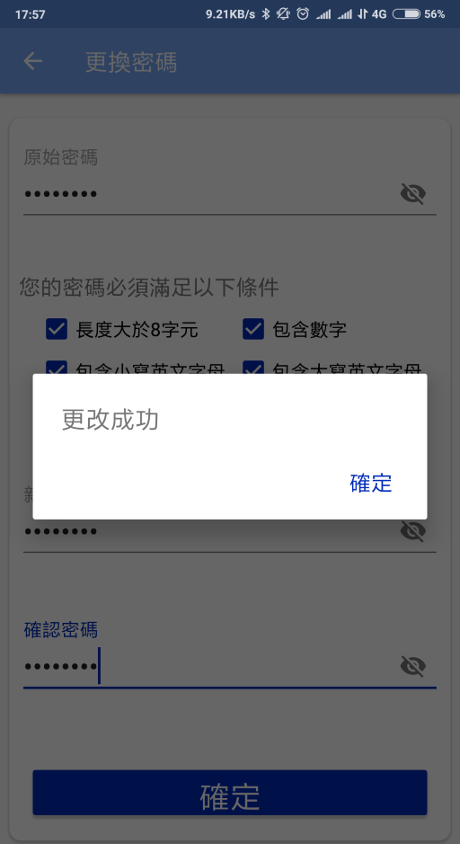

