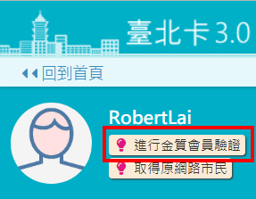
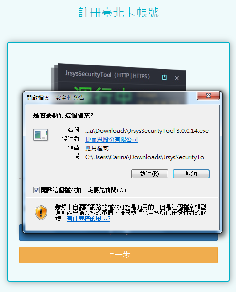
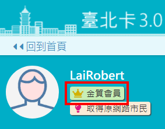

# 一般會員升級金質會員

## 方式1.使用自然人憑證升級為金質會員

###  step1 使用者透過線上認證\(手機帳號認證、電子郵件認證\)或經由手機安裝\[行動台北卡\]應用程式註冊成為一般會員。

###  step2 使用者以一般會員身分登入系統，在個人資料維護功能裡，點擊 \[金質會員認證\] ，透過 自然人憑證認證成功來升級成金質會員。

####  1.進行金質會員認證

#### 2.下載安控元件

####  3.安裝安控元件 

#### 點擊\[執行\]按鈕

####  4.執行安控元件

####  5.輸入身分證字號

####  6.輸入密碼\(長度只能6到8碼\)

####  7.成功升級為金質會員

## 方式2.臨櫃作業：透過臨櫃服務人員協助，升級金質會員

###  使用者到區公所及台北卡整合之各項服務申辦窗辦理，提供相關文件證明，透過臨櫃服務人員協助申請註冊為金質會員。



