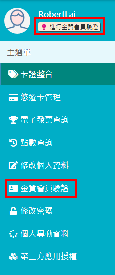
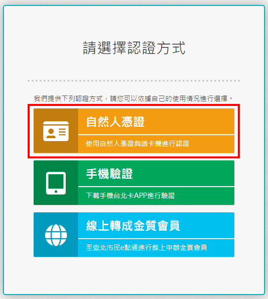
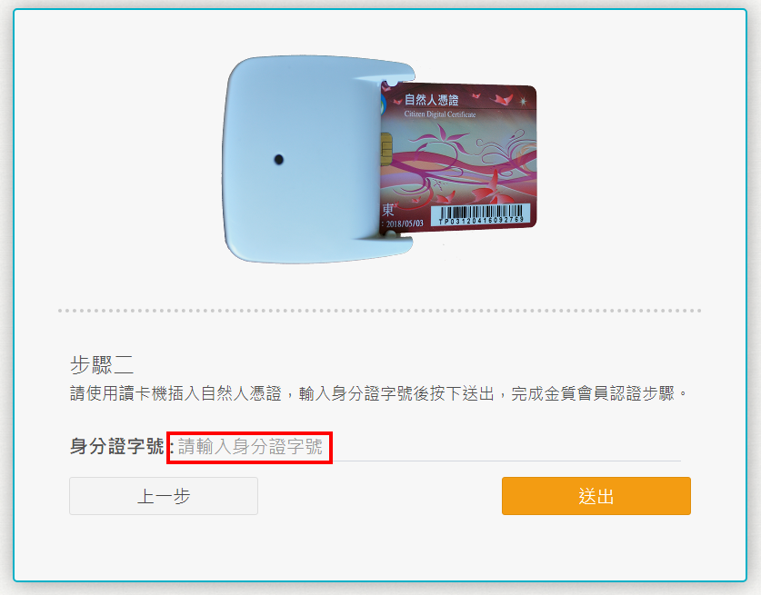

# 一般會員升級金質會員

## 方式1.使用自然人憑證升級為金質會員

###  step1 使用者透過線上認證\(手機帳號認證、電子郵件認證\)或經由手機安裝\[行動台北卡\]應用程式註冊成為一般會員。

###  step2 使用者以一般會員身分登入系統，在個人資料維護功能裡，點擊 \[金質會員認證\] ，透過 自然人憑證認證升級成金質會員。

####  1.進行金質會員認證

#### 2.選擇驗證方式

* 點選\[手機驗證\]會彈出說明請使用\[行動台北卡\]APP進行電信驗證
* 點選\[線上轉成金質會員\]會開啟\[臺北市民E點通\]網站中\[臺北卡金質會員驗證申請\]的網頁

#### 3.下載安控元件

####  4.安裝安控元件 

#### 點擊\[執行\]按鈕

※點選下一步或我接受，完成安裝，並啟動程式

#### 6.安控元件安裝完成，請重新啟動瀏覽器

####  7.執行安控元件

####  8.輸入身分證字號

####  9.輸入自然人憑證密碼\(長度為6到8碼\)

####  10.成功升級為金質會員

* 已驗證為金質會員，姓名下方顯示金色皇冠和金質會員字樣。
* 多了一個帳號可供登入，仍可使用原本註冊的手機或郵件帳號登入。

## 方式2.臨櫃作業：透過臨櫃服務人員協助，升級金質會員

###  使用者到區公所及台北卡整合之各項服務申辦窗辦理，提供相關文件證明，透過臨櫃服務人員協助申請註冊為金質會員。

## 方法3.電信驗證：透過電信實名驗證，升級金質會員

#### 使用者需準備屬於個人申辦的手機號碼，依照行動台北卡App的指示逐步進行電信驗證，詳細內容請參考台北卡3.0電信實名驗證

## 方法4.臺北市民E點通驗證：透過臺北市民E點通，升級金質會員

使用者需要準備身分證明文件，依據網頁指示填寫相關資料，並將身分資料上傳，由人工進行審核，敬請耐心等待申請完成。



